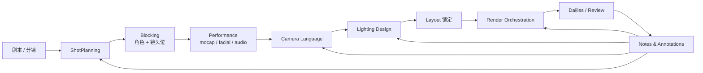

# AI 原生影视创作工作流设计

> 本文档是 `ai-native-scene-model-design.md` 的子设计。
> 范围：从剧本 / 分镜到可交付镜头序列的 AI 协作工作流，覆盖分镜规划、镜头语言、表演驱动、光照设计、渲染编排、Review。
> 引用：CapabilityGraph 实例见 `ai-native-capability-catalog.md`，资产语义见 `ai-native-semantic-pipeline-design.md`，参考图驱动场景生成见 `ai-native-scene-from-image-design.md`。

---

## 0. 设计前提

1. 影视创作的本质循环是 **plan → block → light → render → review**，是迭代式精修，不是一次性生成
2. 影视的"作品"主体是 `SequenceDocument`（Sequence + Shot + Clip + Binding），不是 SceneDocument
3. 影视场景与游戏场景在引擎中可共享 SceneDocument，但 cinematic light / camera / cut 仅活在 SequenceDocument 的 shot_override 层
4. AI 的所有写入仍走 Transaction IR，渲染提交除外（不可撤销，但可 cancel）
5. 复用 B.5 的语义、F 的场景生成、Game 工作流的 capability 边界与 Playtest-style review 思路（这里叫 Dailies）

---

## 1. 工作流总览



各阶段对应文档章节：

- §2 ShotPlanning（剧本 → ShotList → SequenceDocument 草稿）
- §3 Blocking（角色与镜头位摆放）
- §4 Camera Language（镜头语言 capability）
- §5 Performance（mocap / facial / lip-sync）
- §6 Lighting Design（cinematic 光照与 shot override）
- §7 Render Orchestration（本地 / 农场 / 版本树）
- §8 Dailies & Review（A/B 比对、annotation、Notes 回灌）
- §9 与游戏工作流的边界

---

## 2. ShotPlanning

让 AI 把剧本片段转成 ShotList，再生成 SequenceDocument 草稿。

### 2.1 输入

- 剧本（场景 / 对白 / 动作描述）
- 可选分镜参考图（每镜一张或多张）
- 项目元信息（aspect_ratio、fps、镜头时长偏好）

### 2.2 ScriptParser

```text
ScriptScene {
  scene_id, slug, location, time_of_day,
  characters: [name],
  beats: [
    { kind: action | dialog | transition,
      character?: name, text?, duration_hint_s? }
  ]
}
```

约束：

- 不让 LLM 直接输出 SequenceDocument，输出中间 `ScriptScene` 草稿
- ScriptScene 的字段闭集，未识别 beat 类型丢弃 + diagnostics

### 2.3 ShotListPlanner

把 `ScriptScene` 拆为 ShotList：

```text
ShotIntent {
  shot_id, scene_id, beat_range,
  duration_hint_s,
  framing: ECU | CU | MS | FS | LS | EWS | OTS | POV,
  movement: static | pan | tilt | dolly | track | crane | handheld,
  subject_focus: character_id | object_id | env_area_id,
  composition_rule: rule_of_thirds | center | symmetry | leading_lines | golden_ratio,
  reference_image?: uri
}
```

### 2.4 SequenceDraftWriter

把 ShotIntent 转成 SequenceDocument 草稿：

- `sequence.create` + `sequence.add_shot`
- `shot.set_range` 按 duration_hint
- `shot.set_camera_binding` 绑定到自动新建的 cine_camera asset
- `composition.apply_rule` 写入 shot_override
- 所有 verb 标 `provenance = inferred`

### 2.5 失败与降级

| 场景 | 策略 |
|------|------|
| 剧本含未知角色 | 标 `unbound_character`，等 Casting 阶段绑定 |
| beat 时长冲突 | 优先取分镜 hint，否则按对白音节估算，标 `estimated` |
| 参考图与剧本冲突 | 双轨保留，提交用户裁决 |

---

## 3. Blocking

把角色与镜头位放进场景，准备表演。

### 3.1 输入

- SequenceDraft
- SceneDocument（场景资产已就绪，可由 Phase F 提供）
- 角色 ModelDocument

### 3.2 模块

```text
StagingPlanner       -> 放 character placeholder + camera anchor
CameraAnchorSolver   -> 根据 framing/movement 求 camera transform
BlockingValidator    -> 检测穿插 / 出框 / 越轴
```

### 3.3 越轴检测

`BlockingValidator` 必须显式检测 180° 线（screen direction）违反，违反时不阻断但写 diagnostics，由用户决定是否容忍（特殊语言）。

### 3.4 capability 边界

- Blocking 阶段允许大量 `scene.set_transform`（angel scope = scene_instance）
- 不允许触碰 SceneDocument 中标记为 `gameplay_critical` 的 instance
- 所有 cinematic 摄像机 transform 都写入 shot 层，不污染 SceneDocument

---

## 4. Camera Language

镜头语言必须可被 AI 表达且可被审美评价。

### 4.1 镜头参数 capability（来自目录 §4）

- `camera.set_focal_length` / `set_aperture` / `set_focus_distance`
- `camera.move_*` 系列
- `camera.frame_subject`（subject_id + 目标 framing → 自动调位姿与焦距）
- `composition.apply_rule`（闭集规则）

### 4.2 自动 framing solver

`camera.frame_subject` 内部由 solver 实现：

```text
FramingSolveInput {
  subject_bbox_3d, framing_target: CU | MS | ...,
  composition_rule, screen_position_hint?: vec2,
  must_include_objects?: [id]
}
FramingSolveOutput {
  camera_transform, focal_length_mm, focus_distance_m,
  predicted_screen_layout: { subject_bbox_2d, headroom_ratio }
}
```

### 4.3 切换语法（cuts / transitions）

- `cut.add` / `cut.remove`
- transition 类型闭集：`hard_cut | dissolve | fade_in | fade_out | wipe(directional)`
- 不允许 AI 自定义未注册的 transition shader

### 4.4 视觉反馈层

镜头语言审美判断走 §13.4 的双层工作流：

- 语义控制层：调 capability
- 视觉反馈层：渲染 thumbnail，多模态模型给"是否更接近 reference"的反馈
- 反馈结果**不直接 apply**，作为新的 ShotIntent 候选进入 review

---

## 5. Performance

### 5.1 来源

- mocap（动捕系统导入）
- facial（面部捕捉）
- audio-driven lip sync
- 手 K（authored）

### 5.2 流水线

```text
PerformanceClipImport
  -> PerformanceRetarget   (perf.retarget)
  -> PerformanceLayer      (additive / override layer)
  -> SequenceBinding       (binding.bind to character in shot)
```

### 5.3 PerformanceClipDocument

```text
PerformanceClipDocument {
  clip_id, source_kind: mocap | facial | mixed | synth,
  duration_s, sample_rate,
  skeleton_target: skeleton_id,
  tracks: [{ kind: bone | blendshape | curve, target, samples }],
  audio_ref?: uri,
  provenance: authored | mocap | inferred,
  retarget_history: [...]
}
```

### 5.4 lip-sync from audio

- 输入对白音频 + 角色 visme 集
- 输出 blendshape track，标 inferred
- 必须经用户预览（required cfm），不允许直接 apply 到 shot

### 5.5 表演 layering

- 多 PerformanceClip 通过 additive layer 叠加（`perf.layer_additive`）
- 层间冲突由 layer order + weight 决定
- AI 提议 layer 时必须给出"为什么叠这层"的依据（diagnostics-style）

---

## 6. Lighting Design

### 6.1 cinematic vs gameplay

- `lighting.add_light` 的 `usage_kind` 必填
- cinematic 光默认绑定到 shot_override，仅在 sequencer 渲染启用
- gameplay 光绑定 SceneDocument，runtime 始终启用
- 同一物理灯具可同时存在两套版本，互不污染

### 6.2 LightingPlanner

输入：`ShotIntent` + Blocking 结果 + 参考图（可选）

输出：`LightingProposal`（与 Phase F §2.10 同 schema，扩展 cinematic 字段）：

```text
CinematicLightingProposal {
  three_point: { key, fill, rim }       // 各自包含 transform / intensity / color / softness
  practicals: [...]                     // 场景中"道具灯"
  global: { env_intensity_override?, fog?, atmospheric? }
  motivation_notes: string              // 仅记录，不写运行时
}
```

### 6.3 多光设计的歧义

LightingEstimator（Phase F）单图通常给不出多光精确解。在 Cinematic 场景下：

- 默认仅产出 key + env，其余强制走用户确认
- AI 可以根据 reference 一致性自动加 fill / rim，但每加一个光必须 cfm = warn

### 6.4 烘焙

`bake.lighting_gi` 在 cinematic 中可逐 shot 烘焙，烘焙结果 provenance = baked，不能被 inferred 覆盖。

---

## 7. Render Orchestration

### 7.1 RenderJobDocument

```text
RenderJobDocument {
  job_id, sequence_id, shot_filter: [shot_id] | all,
  quality_preset: draft | preview | final,
  resolution, frame_range, codec, color_space, denoiser?,
  output_uri,
  submitted_at?, submitter, status: planned | queued | running | done | failed | canceled,
  artifacts: [{ kind: frames | exr | proxy | thumbnails, uri }],
  cost_estimate?, actual_cost?
}
```

### 7.2 提交策略

- `render.submit_local`：本地机，快但占用编辑器
- `render.submit_farm`：渲染农场，required confirmation（避免误烧资源）
- 所有 final 渲染默认走 farm

### 7.3 版本树

- 每次 submit 生成 RenderJobDocument 的新版本，旧版本不删除
- `render.diff_versions` 在 Dailies 阶段使用
- 引擎维护 LRU 策略清理超期 artifact，但 RenderJobDocument 元信息永存

### 7.4 失败与降级

| 场景 | 策略 |
|------|------|
| Farm 不可用 | 自动建议 local，超大 job 拒绝并请用户裁决 |
| 单帧失败 | 标 frame-level 失败，自动重试 N 次，仍失败标 `partial` |
| 编码后处理失败 | 保留 raw 帧，重试编码 |

---

## 8. Dailies & Review

类比游戏 Playtest 的反馈环。

### 8.1 ReviewDocument

```text
ReviewDocument {
  review_id, sequence_id, base_render_job_id,
  compare_render_job_id?,
  annotations: [
    { id, shot_id, frame, region_2d?, author, kind: note | request_change | approve, text, ts }
  ],
  status: open | resolved
}
```

### 8.2 Notes 回灌

- AI 解析 annotation text，映射到具体 capability 调用候选
- 例："这镜太暗" → 候选 `lighting.shot_override(key.intensity *= 1.4)`
- 候选不直接 apply，进 Transaction IR preview

### 8.3 A/B 比对

- `render.diff_versions` 在 viewport 双联，时间轴同步
- annotation 可以 attach 到具体版本，便于追踪"自这版后变差"

### 8.4 不允许

- AI 自动 resolve 用户的 annotation
- 跨 ReviewDocument 共享 annotation（每个 review 独立闭环）

---

## 9. 与游戏工作流的边界

| 维度 | 游戏 | 影视 |
|------|------|------|
| 主文档 | SceneDocument + GameplayScript | SequenceDocument + Shot/Clip/Binding |
| 反馈环 | Playtest + Telemetry | Dailies + Annotation |
| 时态 | runtime simulation | timeline-driven evaluation |
| 光照 | gameplay light | cinematic light（shot override） |
| 摄像机 | gameplay camera（player-driven） | cine camera（shot-bound） |
| 关键 capability | gameplay.* / level.* / playtest.* | sequence.* / shot.* / camera.* / cut.* / render.* / review.* |
| Ship | release_phase 收紧 | delivery checklist 与 RenderJob 锁定 |

同一项目可同时承载两类工作流，引擎按文档归属与 capability 过滤区分。

---

## 10. 验收标准

下列条件全部满足，本工作流视为可交付：

1. 给一段剧本（≤ 2 页），AI 能在 30 分钟内产出 SequenceDocument 草稿，含 ShotList + 初步 Blocking + key light
2. `camera.frame_subject` 自动 framing 在 80% 常见场景达到可接受构图（headroom / 主体面积比例）
3. lip-sync from audio 在常见英 / 中对白上能产出可用 viseme track（细节由用户调整）
4. cinematic light 与 gameplay light 不会互相污染（两套场景同 instance 各自渲染均通过对照测试）
5. Dailies 中的 annotation 100% 能被映射到候选 capability 调用，未识别 annotation 进入 review 队列
6. RenderJob 即使局部失败，元信息与已完成 artifact 仍可访问
7. 任一外部依赖（farm / mocap / lip-sync 后端）不可用时仍能 degrade 到可继续

---

## 11. 不在范围

- VFX 合成（Nuke / Fusion 类，单独子文档）
- DI / 调色（DaVinci 类，单独子文档）
- 杜比 / 全景声混音
- 实时虚拟制片的 LED 墙同步（单独子文档）
- 影视级布料 / 毛发模拟（共用通用 bake.* capability，参数细节单独）

---

## 12. 后续待办

- ScriptParser 的多语言支持与剧本格式扩展
- ShotListPlanner 的风格模板库（动作 / 对话 / 蒙太奇 / 长镜头）
- 自动 framing solver 的可调权重与镜头语法库
- LightingPlanner 的 reference-driven 学习样本库
- Dailies annotation → capability 映射的训练 / 评测集
- RenderJob 与外部农场调度器（OpenCue / Deadline / Tractor）的适配
- DI / 调色阶段的 capability 化封装边界
