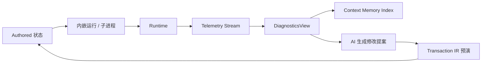

# AI 原生游戏开发工作流设计

> 本文档是 `ai-native-scene-model-design.md` 的子设计。
> 范围：从空项目到可玩 demo 的 AI 协作工作流，覆盖关卡构造、玩法脚本、角色绑定、Playtest 循环、数值调优。
> 引用：CapabilityGraph 实例见 `ai-native-capability-catalog.md`，资产语义见 `ai-native-semantic-pipeline-design.md`，参考图驱动场景生成见 `ai-native-scene-from-image-design.md`。

---

## 0. 设计前提

1. 游戏开发的本质循环是 **build → playtest → diagnose → edit**，不是单向生成
2. AI 必须能进入循环的每一环，而不是只在 build 阶段一次性生成
3. AI 写玩法**不允许**生成自由代码字符串落库；所有玩法变更走受限 AST + capability
4. 所有 AI 产物默认 `provenance = inferred`，必须经 Transaction IR 才能升格为 authored
5. Runtime 状态与 authored 状态严格分离（与总纲 §2 的四层一致）
6. 复用 B.5 的 SemanticMemoryStore、F 的 SceneDraft、C 的 Transaction IR、D 的 Observation Bus

---

## 1. 工作流总览


各阶段对应文档章节：

- §2 关卡白盒（LevelBlockoutPipeline）
- §3 灰盒资产替换（复用 Phase F + AssetMatcher）
- §4 玩法脚本（GameplayScriptingPipeline，受限 AST）
- §5 角色与动画绑定（CharacterRiggingBinding）
- §6 Playtest 循环（PlaytestLoop + DiagnosticsView）
- §7 平衡调优（BalancingPipeline，含数值表分支）
- §8 输入与控制（InputBindingPipeline）
- §9 发布构建（ShipPipeline，capability 受限）

---

## 2. LevelBlockoutPipeline

让 AI 从一句目标（"做一个塔防小关卡"）或一张参考图，产出可走、可玩的白盒。

### 2.1 输入

- 目标短描述
- 可选参考图（走 Phase F）
- 可选关卡尺寸约束（边界、平台数、玩家路径长度）

### 2.2 模块

```text
GoalParser          -> LevelIntent
LevelIntent         -> BlockoutPlanner -> BlockoutPlan
BlockoutPlan        -> VolumeWriter    -> SceneDocument(blockout)
SceneDocument       -> NavmeshBaker    -> NavMesh
NavMesh + Intent    -> PathValidator   -> Diagnostics
```

### 2.3 LevelIntent schema

```text
LevelIntent {
  genre: tower_defense | platformer | shooter | puzzle | exploration | ...
  player_count: int
  win_condition: kill_all | survive_time | reach_zone | collect_n | custom_id
  loss_condition: ...
  bounds_hint: { size_m, shape: rect | irregular }
  must_have: [ spawn_point, exit_zone, cover_volume, choke_point, ... ]
  reference_images: [uri]
}
```

### 2.4 BlockoutPlanner

输出 `BlockoutPlan`：

```text
BlockoutPlan {
  volumes: [{ id, kind, transform, size, role: floor | wall | ramp | platform | cover | trigger }]
  spawn_points: [{ id, transform, faction }]
  exit_zones: [{ id, transform }]
  expected_paths: [{ from_spawn_id, to_exit_id, length_hint_m }]
}
```

约束：

- 所有体块用 `level.create_blockout_volume` 写入
- 不直接放最终资产，留给灰盒阶段
- 必须保证 `expected_paths` 在 NavMesh 上可达，否则 PathValidator 报错回灌

### 2.5 PathValidator 与回灌

PathValidator 用 NavMesh 验证 `expected_paths`，失败时把诊断写回 BlockoutPlanner，让 AI 改一次（最多 3 次），仍失败则进入 MinimalConfirmationUI 让用户决策。

### 2.6 失败与降级

| 场景 | 策略 |
|------|------|
| 参考图缺失 | 走纯 LevelIntent，BlockoutPlanner 用类目模板 |
| Navmesh bake 超时 | 输出体块草稿，path 不验，标 `partial` |
| AI 反复无法满足 must_have | 标 `unresolvable_intent`，请用户调整 intent |

---

## 3. GameplayScriptingPipeline（受限 AST）

游戏玩法是这套架构里**最容易出事**的地方，必须强约束。

### 3.1 不允许的事

- AI 直接产出 C# / C++ / Lua / GDScript 字符串后入库
- 通过反射调用未登记的引擎 API
- 跨场景修改未声明的 component
- 构造引擎内未注册的事件类型

### 3.2 允许的事

AI 通过两个文档表达玩法：

- `GameplayScriptDocument`：事件 → 动作 的图，节点是 `GameplayActionRegistry` 中的 action id
- `BehaviorTreeDocument` / `FsmDocument`：行为决策

两者底层都是受限 AST：

```text
ScriptNode {
  id, kind: trigger | condition | action | branch | loop
  ref: registered_action_id
  args: { ... }            // schema 来自 action 注册表
  children: [ScriptNode]
}
```

### 3.3 GameplayActionRegistry

引擎维护一份白名单：每个 action 有 id、参数 schema、副作用声明（读 / 写哪些 component / 是否网络同步 / 是否阻塞）。

AI 写脚本时只能从注册表选 action。注册表外的能力必须由工程师先**注册**，再供 AI 使用。

### 3.4 流水线

```text
NaturalLanguageIntent
  -> ScriptPlanner         (选 trigger + 编排 action)
  -> ScriptDraft (AST)
  -> ScriptValidator       (schema / 副作用 / 死循环检测)
  -> ScriptPreviewExecutor (在 preview world 跑一次空 trigger)
  -> Transaction IR        (`gameplay.create_event_handler` 等 verb)
  -> 写入 GameplayScriptDocument
```

### 3.5 ScriptValidator 检查项

- 节点引用的 action 是否在注册表
- 参数 schema 是否合法
- 是否存在没有出口的循环 / 递归
- 是否调用 destructive verb 而未带确认
- 是否触及未声明的 component（白盒读写表）

### 3.6 BehaviorTree / FSM

行为树和状态机是玩法脚本的子集，特化为决策结构。

- BT 节点种类闭集：`Selector | Sequence | Parallel | Decorator | LeafAction | LeafCondition`
- FSM 状态闭集由项目模板定义
- AI 通过 `gameplay.add_behavior_tree` / `gameplay.add_fsm_state` 等 verb 写入

### 3.7 失败与降级

| 场景 | 策略 |
|------|------|
| 注册表缺失某 action | 报告 `missing_action`，让用户决定补注册或换思路 |
| Validator 多轮失败 | 把失败 AST 提交到 review 队列，不阻断其他工作 |
| Preview executor 触发崩溃 | 自动回滚 preview world，不污染主 SceneDocument |

---

## 4. CharacterRiggingBinding

让 AI 把角色资产接入到关卡里能跑能跳能挨打。

### 4.1 阶段

1. 角色资产准备（B.5 流水线产出 ModelDocument + Skeleton + Sockets）
2. 动画图配置（`anim.*` capability）
3. 角色 prefab 创建（`prefab.create_from_instance`）
4. 输入与行为绑定（GameplayScriptDocument + InputMapDocument）
5. 表演接入（mocap / facial / lipsync 来自 `perf.*` capability）

### 4.2 AnimationGraphDocument 字段（节选）

```text
AnimationGraphDocument {
  state_machine: { states[], transitions[], default_state }
  blend_spaces: [...]
  ik_chains: [{ chain_name, target_socket, weight }]
  socket_attachments: [{ socket, attached_prefab, scope }]
}
```

### 4.3 AI 在角色阶段能做什么

- 根据 ModelSemanticSummary 自动绑定常见 socket（hand_l / hand_r / head / spine）
- 根据动画 clip 标签自动建立基本状态机骨架（idle / walk / run / jump / attack）
- 不允许 AI 自动绑定**网络相关**或**物理破坏性**的事件（必须用户确认）

### 4.4 失败与降级

| 场景 | 策略 |
|------|------|
| Skeleton 与 mocap 拓扑不匹配 | 调 `perf.retarget`，失败则进入用户骨骼配对 UI |
| Socket 缺失 | 由 SemanticAnalyzer 推断候选 socket 位置，标 inferred |

---

## 5. PlaytestLoop

把 AI 接到运行中游戏的反馈环，是这份文档与传统 AI 工具的关键差异。

### 5.1 结构



### 5.2 PlaytestSessionDocument

```text
PlaytestSessionDocument {
  session_id, scene_doc_revision, started_at, ended_at,
  participants: [user | ai_bot],
  telemetry_streams: [stream_id],
  events_recorded: int,
  diagnostics_snapshots: [snapshot_id]
}
```

### 5.3 Telemetry 必须项

- 帧率与卡顿点
- 玩家死亡事件（位置、原因、当前装备）
- 任务节点完成时间
- 关键 trigger 命中率
- 输入分布
- 资源消耗（内存 / GPU）

Telemetry 全部走 Observation Bus 的事件流，DiagnosticsView 是其物化视图。

### 5.4 DiagnosticsView 给 AI 的符号化呈现

```text
DiagnosticsSymbolicView {
  session_id, scene_doc_revision,
  metrics: { fps_p50, fps_p10, hitch_count, ... },
  hotspots: [{ kind: death | softlock | low_fps_zone, location_m, count }],
  player_path_summary: { length_m, dead_ends[] },
  unresolved_intents: [...]   // 玩家未达成的 win/loss condition
}
```

### 5.5 AI 提案约束

- 提案不能直接 apply，必须经 Transaction IR
- 提案必须引用具体 diagnostics hotspot id 作为依据
- 一轮 playtest 内同一 hotspot 提案次数有上限，避免 AI 反复改同一处

### 5.6 失败与降级

| 场景 | 策略 |
|------|------|
| 运行时崩溃 | 保留 telemetry 到崩溃点，标 `crashed`，提示用户提交 minidump |
| Telemetry 流断开 | 提案禁用，仅允许只读 review |
| AI bot 卡死 | 自动 timeout + 重启 session，记 diagnostics |

---

## 6. BalancingPipeline

数值调优是高频迭代区，需要分支与对比。

### 6.1 DataTableDocument

```text
DataTableDocument {
  table_id, columns: [...], rows: [...],
  branches: [{ branch_id, base_revision, rows_overlay, owner }],
  active_branch: branch_id
}
```

### 6.2 工作流

1. AI 基于 DiagnosticsView 提议数值变更（`gameplay.fork_data_table_branch`）
2. 在 fork 分支上做改动，runtime playtest 切到该分支
3. 多分支对比（`render.diff_versions` 的数据版）
4. 选定后 `gameplay.merge_data_table_branch`（required confirmation）

### 6.3 不允许

- AI 在 active branch 上直接改主表
- 跨表隐式联动（必须显式声明 dependent_tables）

---

## 7. InputBindingPipeline

### 7.1 InputMapDocument

```text
InputMapDocument {
  contexts: [{ id, name }],   // ui / gameplay / vehicle / dialog ...
  bindings: [{ context_id, action_id, primary, secondary, modifier? }],
  device_profiles: [...]
}
```

### 7.2 AI 能力

- 从 GameplayActionRegistry 自动建议绑定
- 检测冲突（同一 context 同 key 多 action）
- 推荐手柄 / 键鼠 / 触摸三套 profile

### 7.3 约束

- AI 不能改默认 ui context 的退出 / 暂停键，必须 user 确认
- 任何绑定变更走 `gameplay.bind_input` verb

---

## 8. ShipPipeline

发布期间 AI 的 capability 显著收紧。

### 8.1 收紧策略

| 阶段 | 允许的 capability |
|------|--------------------|
| pre-alpha | 全部 |
| alpha | 资产 / 玩法 / 关卡可改；project_config 需 required confirmation |
| beta | 玩法仅允许 data table 修改；新增 action 禁用 |
| rc / ship | 仅允许 data table 修复型变更（标 hotfix），其他全部禁用 |

策略由 `ProjectDocument.release_phase` 控制，CapabilityGraph 据此过滤可用 verb。

### 8.2 审计

- ship 阶段的所有 AI 提案必须留 audit trail，包含：提案者、batch_id、diagnostics 依据、确认者
- 审计记录写入 `ReleaseAuditDocument`，不可删除

---

## 9. 与其他文档的对齐

- 玩法 AST 节点引用的 action id 由 `ai-native-capability-catalog.md` §7 与 `GameplayActionRegistry` 共同维护
- 关卡灰盒阶段调用的资产生成 / 检索是 Phase F 的子流程
- 角色 ModelDocument / SemanticSummary 来自 B.5
- Telemetry / DiagnosticsView 是总纲 §12 Observation Bus 与 Memory Index 的具体物化

---

## 10. 验收标准

下列条件全部满足，本工作流视为可交付：

1. 从空项目到可玩白盒 demo（含一种胜利条件、一种失败条件、一个角色）≤ 60 分钟人机协作
2. AI 在 Playtest 循环中能自动定位前 3 个 hotspot 并产出可预演的修改提案
3. 全部玩法脚本均为受限 AST，零自由代码字符串入库
4. ship 阶段尝试调用受限 verb 100% 被拒并留审计
5. DataTable 分支可在 60 秒内切换并跑 playtest
6. 任一关键模块（NavmeshBaker / ScriptValidator / Telemetry）失效时，工作流仍能在降级模式继续

---

## 11. 不在范围

- 多人 / 网络同步的 AI 自动化（单独子文档）
- VFX / 粒子（单独子文档）
- 音频混音 / 配乐生成（单独子文档）
- 商业化系统（IAP / battle pass）
- 反作弊 / 安全（不应由 AI 直接编辑）

---

## 12. 后续待办

- `GameplayActionRegistry` 的注册流程与版本管理
- AI bot playtest 的策略库（探索 / 攻坚 / 速通 / 鲁莽）
- DiagnosticsView 的领域专用 metrics 模板（FPS-only / 战斗 / 解谜）
- Ship 阶段 hotfix 的灰度发布流程
- 与版本控制的集成（commit 粒度、PR 自动化）
