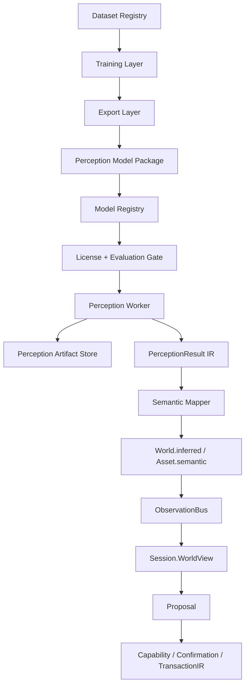

# AI 原生感知运行时设计

> **定位**：本文档定义 Guava 的 Perception Runtime：把检测、分割、深度、姿态、embedding、开放词表识别等视觉模型能力接入 World `inferred` 层与 Asset semantic 层。
>
> Perception Runtime 不是一个具体模型库，也不是 "把 YOLO 接进 Editor"。它是模型无关的感知基础设施：模型可以替换，训练框架可以替换，部署后端可以替换；Guava 内部只依赖稳定的模型包契约、请求契约、结果 IR、许可证 gate、评估 gate 与 World 写入路径。
>
> 本文是 `ai-native-semantic-pipeline-design.md` 中 `VisionBackend` 的底层运行时设计，也是 `ai-native-scene-from-image-design.md` 中 `InstanceSegmenter` / `DepthNormalEstimator` / `AssetMatcher` 的统一执行层。

---

## 0. 核心结论

Guava 不应该把任一第三方模型库作为 AI 架构核心。

正确边界是：

```text
Training Framework / Model Repo
        ↓
Exported Model Package
        ↓
Perception Worker
        ↓
Guava Perception IR
        ↓
World.inferred / Asset.semantic / ObservationBus
        ↓
Session / Proposal / TransactionIR
```

长期稳定的是：

1. `PerceptionModelManifest`：模型包元数据、任务、输入输出契约、许可证、数据来源、导出格式。
2. `PerceptionRequest`：Guava 调用感知模型的统一请求。
3. `PerceptionResult`：检测、分割、深度、姿态、embedding 等结果的统一 IR。
4. `PerceptionEvidence`：所有推断的 provenance、confidence、source 与 artifact handle。
5. `LicenseGate`：代码、权重、训练数据、商用状态分开校验。
6. `EvaluationGate`：模型进项目前必须通过精度、稳定性、延迟、漂移与回归测试。
7. `WorldWritePolicy`：感知结果只能写 `inferred`，不能覆盖 `authored`，不能直接生成 `TransactionIR`。

模型库只是 adapter。D-FINE、RT-DETR、YOLOX、MMDetection、SAM 2、GroundingDINO、Depth Anything、OpenCLIP 都必须服从同一个 IR。

---

## 1. 设计前提

1. **模型输出不是编辑命令**。检测到 "chair" 不等于创建椅子实体；它只是一个带置信度的 observation。
2. **AI 感知不写 authored truth**。所有自动推断写入 `inferred`，必须允许用户覆盖、确认或删除。
3. **Guava 内核不依赖 Python / PyTorch / CUDA ABI**。训练与推理进程隔离，Engine 和 Editor 只消费稳定协议。
4. **许可证是运行时能力的一部分**。模型能不能在项目中启用，不只看精度，也看 code license、weights license、dataset lineage 与项目 policy。
5. **数据契约比模型选择更重要**。如果契约稳定，模型换代只是 adapter 与模型包更新；如果契约漂移，后续会重写 Editor、World、Session 与工具链。
6. **感知模型负责证据，Session 负责创作判断**。LLM/Session 读取 WorldView 中的 inferred 语义后生成 Proposal，仍走 Capability / Confirmation / Transaction。
7. **所有二进制产物通过 handle 引用**。mask、depth map、embedding、crop、turntable render 不进入事件 payload 和 LLM prompt。
8. **训练数据必须一等公民化**。没有 dataset manifest、标注 schema、split、license、版本和评估记录的模型不能成为默认能力。

---

## 2. 非目标

本文不定义：

1. 具体模型结构的训练细节，例如 DETR decoder、YOLO head、SAM prompt encoder。
2. 任何第三方仓库的内部 API。
3. 由图片直接生成最终可用 3D 资产的完整流程。
4. LLM prompt 技巧。
5. 绕过 TransactionIR 的自动编辑路径。

本文定义的是 Guava 如何安全、可替换、可训练、可审计地使用这些模型。

---

## 3. 顶层架构



模块职责：

| 模块 | 职责 | 不能做 |
|---|---|---|
| `DatasetRegistry` | 管理训练/验证数据集、标注版本、license、split | 不能隐式读取未登记数据 |
| `TrainingLayer` | 训练、微调、导出候选模型 | 不能成为 Editor 运行时依赖 |
| `ExportLayer` | 生成 ONNX / Core ML / OpenVINO / TensorRT 等部署格式 | 不能改变输出语义 |
| `ModelRegistry` | 登记模型包、版本、hash、license、metrics | 不能只按文件名识别模型 |
| `LicenseGate` | 根据项目策略决定模型是否可启用 | 不能只看 repo license |
| `EvaluationGate` | 根据评估结果决定模型是否可作为默认后端 | 不能跳过回归集 |
| `PerceptionWorker` | 隔离执行模型推理 | 不能直接调用 SceneRuntime mutation |
| `ArtifactStore` | 存 mask、depth、embedding、crop、debug overlay | 不能把大二进制塞进 event |
| `SemanticMapper` | 把模型标签映射为 Guava semantic ontology | 不能把 COCO label 当最终语义 |
| `WorldWriter` | 写 `inferred` / asset semantic / observation event | 不能覆盖 authored |

---

## 4. 模型包格式

每个可运行模型必须被打包成 `PerceptionModelPackage`。包是目录，不是裸权重文件。

```text
chair_detector_dfine_v1.guavaperception/
├── manifest.json
├── model.onnx
├── labels.json
├── ontology_map.json
├── preprocessing.json
├── postprocessing.json
├── metrics.json
├── license/
│   ├── code_license.txt
│   ├── weights_license.txt
│   └── dataset_lineage.json
└── checksums.json
```

### 4.1 Manifest

```json
{
  "schema_version": "guava.perception.model_manifest.v1",
  "model_id": "dfine_coco_v1",
  "display_name": "D-FINE COCO Detector",
  "task": "object_detection",
  "backend_family": "dfine",
  "runtime": {
    "preferred": "onnxruntime",
    "fallbacks": ["coreml", "openvino"],
    "device_policy": ["gpu", "cpu"]
  },
  "files": {
    "model": "model.onnx",
    "labels": "labels.json",
    "ontology_map": "ontology_map.json",
    "preprocessing": "preprocessing.json",
    "postprocessing": "postprocessing.json"
  },
  "input_contract": "guava.perception.input.rgb_image.v1",
  "output_contract": "guava.perception.output.detections.v1",
  "license": {
    "code_license": "Apache-2.0",
    "weights_license": "Apache-2.0",
    "dataset_lineage": ["COCO-2017", "guava_custom_assets_v1"],
    "commercial_use": "allowed",
    "redistribution": "allowed",
    "requires_attribution": true,
    "requires_share_alike": false,
    "non_commercial_only": false
  },
  "evaluation": {
    "metrics_file": "metrics.json",
    "minimum_gate": "guava.perception.gate.default_detector_v1"
  },
  "created_at": "2026-05-23T00:00:00Z",
  "source": {
    "training_repo": "https://github.com/Peterande/D-FINE",
    "commit": "<pinned-commit>",
    "export_tool": "guava-export-dfine",
    "export_commit": "<pinned-commit>"
  }
}
```

约束：

1. `model_id` 是稳定 ID，不随文件名变化。
2. `source.commit` 必须固定到具体 commit，不允许只写 branch。
3. `license` 分 code / weights / dataset，不允许只写 "Apache"。
4. `input_contract` 和 `output_contract` 是闭集 schema id。
5. `commercial_use` 不能由模型包作者手写为事实，必须由 `LicenseGate` 审核后缓存。

### 4.2 支持的任务类型

```text
PerceptionTask =
  object_detection
  instance_segmentation
  semantic_segmentation
  panoptic_segmentation
  depth_estimation
  normal_estimation
  pose_estimation
  tracking
  image_embedding
  text_image_grounding
  classification
```

每个任务有独立 output contract。禁止让所有模型输出自由 JSON。

---

## 5. 训练数据格式

Guava 内部数据集必须有 dataset manifest。外部数据集也要登记引用，不允许只有本地路径。

```text
DatasetManifest {
  id: DatasetId,
  schema_version: Version,
  task: PerceptionTask,
  storage_uri: ArtifactURI,
  annotation_format: coco | yolo | pascal_voc | guava_scene | guava_asset_region,
  ontology_id: OntologyId,
  splits: {
    train: SplitSpec,
    val: SplitSpec,
    test: SplitSpec,
    regression: SplitSpec
  },
  license: DatasetLicense,
  provenance: [DatasetSource],
  transform_log: [DatasetTransform],
  created_at: Timestamp
}
```

### 5.1 内部标注本体

COCO、OpenImages、LVIS、YOLO label 都不能成为 Guava 的最终本体。Guava 需要自己的 `SemanticOntology`。

```text
SemanticOntology
├── object_category          # chair / door / wheel / panel
├── functional_role          # cover / control / handle / trigger_zone
├── material_hint            # glass / metal / cloth / skin
├── gameplay_role            # pickup / enemy / spawn_point / hazard
├── cinematic_role           # key_light / hero_prop / background
└── confidence_policy        # auto / confirm / never_auto
```

模型标签通过 `ontology_map.json` 映射：

```json
{
  "source_label_space": "coco_80",
  "mappings": [
    {
      "source_label": "chair",
      "guava_kind": "object_category",
      "guava_label": "chair",
      "confidence_scale": 1.0,
      "requires_confirmation": false
    },
    {
      "source_label": "person",
      "guava_kind": "object_category",
      "guava_label": "humanoid",
      "confidence_scale": 0.75,
      "requires_confirmation": true
    }
  ]
}
```

约束：

1. 一个 source label 可以映射多个 Guava semantic candidates。
2. `requires_confirmation` 可由 ontology、项目策略、模型评估结果共同决定。
3. 没有映射的 label 只能作为 raw evidence，不能写成稳定 semantic role。

---

## 6. 请求契约

```text
PerceptionRequest {
  id: RequestId,
  model_selector: ModelSelector,
  task: PerceptionTask,
  input: PerceptionInput,
  context: PerceptionContext,
  output_policy: OutputPolicy,
  deadline_ms: optional int,
  trace_id: TraceId
}
```

### 6.1 输入类型

```text
PerceptionInput =
  ImageInput {
    image_uri,
    color_space,
    width,
    height,
    exif_orientation_applied,
    camera_hint?
  }
  ImageRegionInput {
    image_uri,
    bbox,
    mask_uri?,
    region_id?
  }
  TurntableInput {
    asset_uri,
    render_set_uri,
    region_overlay_uri?
  }
  VideoInput {
    video_uri,
    frame_range,
    fps_sample
  }
  TextGroundingInput {
    image_uri,
    prompt,
    vocabulary_policy
  }
```

### 6.2 上下文

```text
PerceptionContext {
  project_id,
  scene_id?,
  asset_id?,
  entity_ref?,
  candidate_region_ids: [RegionId],
  user_hint?: {
    category?,
    negative_labels?,
    scale_hint?,
    workflow_mode?
  },
  privacy_policy,
  license_policy,
  locale
}
```

上下文只能帮助模型缩小推理范围，不能允许 worker 修改 project / scene。

---

## 7. 结果 IR

所有模型输出统一进入 `PerceptionResult`。

```text
PerceptionResult {
  schema_version,
  request_id,
  model_id,
  model_version,
  task,
  status: success | partial | failed | skipped_by_policy,
  observations: [PerceptionObservation],
  artifacts: [ArtifactRef],
  diagnostics: [PerceptionDiagnostic],
  timing: TimingInfo,
  provenance: PerceptionProvenance
}
```

### 7.1 Observation

```text
PerceptionObservation =
  DetectedObject
  SegmentedInstance
  SemanticRegion
  DepthEstimate
  NormalEstimate
  PoseEstimate
  Track
  ImageEmbedding
  Classification
  GroundedTextMatch
```

### 7.2 DetectedObject

```json
{
  "kind": "detected_object",
  "id": "obs_001",
  "label": "chair",
  "label_space": "coco_80",
  "semantic_candidates": [
    {
      "kind": "object_category",
      "label": "chair",
      "confidence": 0.91
    }
  ],
  "confidence": 0.91,
  "bbox_2d": {
    "space": "image_pixel",
    "x": 120,
    "y": 80,
    "width": 300,
    "height": 260
  },
  "mask_ref": null,
  "target": {
    "asset_id": null,
    "entity_ref": null,
    "region_id": null
  },
  "evidence": [
    {
      "kind": "detector",
      "source": "dfine_coco_v1",
      "confidence": 0.91
    }
  ]
}
```

### 7.3 SegmentedInstance

```text
SegmentedInstance {
  id,
  label?,
  confidence,
  bbox_2d,
  mask_ref,
  contour_quality: clean | fuzzy | broken,
  occlusion_ratio,
  target?,
  evidence
}
```

`mask_ref` 指向 artifact store。mask 不进 JSON payload。

### 7.4 DepthEstimate

```text
DepthEstimate {
  id,
  depth_ref,
  scale_kind: relative | metric | unresolved,
  reliability_ref,
  metric_scale_hint?,
  camera_hint?,
  confidence,
  evidence
}
```

深度估计默认不能直接生成 3D 布局。只有当 `scale_kind = metric` 或 `LayoutSolver` 成功求解约束后，才能进入 scene draft。

### 7.5 ImageEmbedding

```text
ImageEmbedding {
  id,
  embedding_ref,
  model_id,
  vector_space_id,
  source_crop?,
  normalization,
  evidence
}
```

embedding 永远不进 LLM prompt。Session 只能看到检索后的符号候选，例如 asset id、match score、thumbnail handle。

---

## 8. Artifact Store

二进制产物统一存入 `PerceptionArtifactStore`。

```text
ArtifactRef {
  uri,
  content_hash,
  media_type,
  byte_size,
  semantic_kind: mask | depth | normal | embedding | crop | overlay | debug_log,
  retention: ephemeral | project_cache | persistent,
  redaction: prompt_safe | prompt_forbidden
}
```

约束：

1. ObservationBus 事件只带 `ArtifactRef`，不带 bytes。
2. LLM prompt 只能接收 `prompt_safe` 的符号摘要，不能接收 raw embedding。
3. `ephemeral` artifact 可被缓存清理，不得成为 authored state 的唯一依据。
4. `persistent` artifact 必须有 content hash 和 provenance。

---

## 9. World 写入策略

感知结果进入 World 只走 `WorldWritePolicy`。

```text
PerceptionResult
  → SemanticMapper
  → InferredWriteSet
  → AmbiguityScorer
  → AutoCommit | MinimalConfirmationUI
  → WorldEvent.entityInferredUpdated / asset.semantic.updated
```

### 9.1 InferredWriteSet

```text
InferredWriteSet {
  target: entity | asset | region | scene_slot,
  writes: [
    {
      property,
      value,
      confidence,
      source,
      evidence_refs,
      overwrite_policy: never_authored | replace_weaker_inferred | append_candidate
    }
  ]
}
```

### 9.2 写入规则

1. `authored` 永远优先于 `inferred`。
2. 新 inferred 值只能替换更弱或同源旧 inferred 值。
3. 多模型冲突时不能静默覆盖，必须记录 alternatives 或触发确认。
4. 破坏性能力、资产本体重写、拓扑修改、scene mutation 都不能由 Perception Runtime 直接执行。
5. Session 读取 inferred 后生成的 Proposal 仍必须走 Capability / Confirmation / TransactionIR。

---

## 10. Worker 边界

Guava 主进程不直接加载训练框架。Perception Worker 是独立进程，可本地或远程。

```text
Editor / Engine
    └── PerceptionClient
          └── IPC / HTTP / gRPC
                └── PerceptionWorker
                      ├── RuntimeAdapter
                      ├── ModelLoader
                      ├── Preprocessor
                      ├── InferenceRunner
                      ├── Postprocessor
                      └── ArtifactWriter
```

### 10.1 Worker 能力发现

```text
WorkerCapabilities {
  worker_version,
  supported_tasks,
  supported_runtimes,
  devices,
  loaded_models,
  max_batch_size,
  artifact_store_uri,
  health
}
```

### 10.2 Worker 禁止事项

1. 不能读写 SceneRuntime 内存。
2. 不能写 project 文件，除非通过 ArtifactStore 分配的路径。
3. 不能持有 API key，除非模型后端本身是远程服务且通过 SecretProvider 注入。
4. 不能把模型原始输出直接发给 Session；必须经过 IR validator。
5. 不能绕过 LicenseGate 加载模型。

---

## 11. 许可证 Gate

许可证检查是模型加载前置条件。

```text
LicenseGateInput {
  project_policy,
  model_manifest,
  dataset_manifests,
  distribution_mode: local_dev | internal_tool | commercial_binary | cloud_service,
  offline_mode
}
```

```text
LicenseGateDecision =
  allowed
  allowed_with_attribution
  disabled_non_commercial
  disabled_share_alike
  disabled_unknown_weights_license
  disabled_unknown_dataset_lineage
  disabled_policy_violation
```

### 11.1 必须分开审计

| 项 | 说明 |
|---|---|
| code license | 训练/推理代码仓库许可证 |
| weights license | checkpoint / exported model 权重许可证 |
| dataset license | 训练数据与标注数据许可证 |
| generated data license | 合成数据、渲染数据、用户数据授权 |
| redistribution | Guava 是否能随安装包分发 |
| commercial use | 商业闭源项目是否能默认启用 |
| attribution | UI / 文档 / about 页面是否要展示 |

### 11.2 推荐默认策略

```text
GuavaDefaultCommercialPolicy:
  allow_code: Apache-2.0 | MIT | BSD-2-Clause | BSD-3-Clause
  deny_code: AGPL | GPL | LGPL unless isolated_and_reviewed
  allow_weights: Apache-2.0 | MIT | BSD | public-domain | guava-owned
  deny_weights: CC-BY-NC | research-only | unknown
  allow_dataset: guava-owned | permissive-commercial | user-owned
  deny_dataset: non-commercial | unknown | personal-use-only
```

注意：仓库是 Apache-2.0 不代表权重和数据集也可商用。模型包必须记录三者。

---

## 12. 推荐模型与框架

以下是起步推荐，不是 Guava 内部标准。内部标准永远是 manifest + IR。

| 能力 | 推荐 | 默认定位 | 许可证注意 |
|---|---|---|---|
| 训练框架 | [MMEngine](https://github.com/open-mmlab/mmengine) + [MMDetection](https://github.com/open-mmlab/mmdetection) | 长期训练底座 | OpenMMLab 代码通常是 Apache-2.0；具体模型权重单独审 |
| 实时检测 | [D-FINE](https://github.com/Peterande/D-FINE) | 默认 detector 候选 | 审 code / weights / dataset |
| 实时 DETR | [RT-DETR](https://github.com/lyuwenyu/RT-DETR) | detector 候选 | 审导出链路与权重 |
| YOLO 风格检测 | [YOLOX](https://github.com/Megvii-BaseDetection/YOLOX) | 备选 detector | Apache-2.0 代码；权重单独审 |
| 分割/跟踪 | [SAM 2](https://github.com/facebookresearch/sam2) | promptable mask / video mask | 审 checkpoint 与依赖许可证 |
| 开放词表定位 | [GroundingDINO](https://github.com/IDEA-Research/GroundingDINO) | text-grounding 后端 | 锁定 repo、commit、weights 条款 |
| 深度 | [Depth Anything V2](https://github.com/DepthAnything/Depth-Anything-V2) Small | relative depth 后端 | Small 可作为默认候选；大模型若是 non-commercial 禁止默认启用 |
| Embedding | [OpenCLIP](https://github.com/mlfoundations/open_clip) | asset retrieval | 权重与训练数据来源单独登记 |
| 部署 | [ONNX Runtime](https://github.com/microsoft/onnxruntime) / Core ML / OpenVINO / TensorRT | runtime adapter | 主进程只依赖稳定 runtime，不依赖训练 repo |

选择策略：

1. 训练底座优先选生态成熟、配置可复现、许可证友好的框架。
2. 运行时优先使用 exported model，避免把训练框架带进 Editor。
3. 每类能力至少支持两个模型家族，防止单点许可或技术路线风险。
4. 默认启用模型必须通过 LicenseGate 和 EvaluationGate。

---

## 13. 训练与导出

### 13.1 训练输入

```text
TrainingJob {
  id,
  task,
  base_model_id?,
  dataset_ids,
  config_uri,
  output_model_id,
  seed,
  hardware_profile,
  expected_metrics,
  license_policy
}
```

### 13.2 训练输出

```text
TrainingRunRecord {
  job_id,
  git_commits,
  dataset_versions,
  config_hash,
  checkpoints,
  metrics,
  failure_modes,
  exported_packages,
  reproducibility_status
}
```

### 13.3 导出要求

导出后的模型包必须通过：

1. schema validation
2. checksum validation
3. license validation
4. smoke inference
5. golden image regression
6. latency benchmark
7. numeric tolerance comparison between training runtime and exported runtime

---

## 14. 评估 Gate

模型不能因为单次 demo 成功就进入默认能力。

```text
EvaluationGate {
  quality_metrics,
  latency_metrics,
  stability_metrics,
  regression_metrics,
  domain_metrics,
  safety_metrics
}
```

### 14.1 Detector 默认门槛

```text
DetectorGateV1 {
  mAP50_min,
  mAP50_95_min,
  false_positive_rate_max,
  missed_required_class_rate_max,
  latency_p50_ms_max,
  latency_p95_ms_max,
  exported_runtime_delta_max,
  license_decision_must_be_allowed
}
```

### 14.2 Asset semantic 门槛

资产语义不是 COCO mAP 问题。需要单独评估：

1. region identity 稳定性：同资产重导入后 region id 是否稳定。
2. semantic candidate 准确率：top-1 / top-3 是否可用。
3. ambiguity 质量：不确定时是否触发确认，而不是错误 auto commit。
4. confirmation 学习：用户确认后的 memory 是否在同族资产复用。
5. prompt safety：进入 Session 的摘要是否不包含 raw image / embedding / 私有字段。

---

## 15. 与现有文档的关系

| 文档 | Perception Runtime 的位置 |
|---|---|
| `architecture.md` | World 的 `inferred` 层、Signal、Session、Proposal 总纲 |
| `ai-native-semantic-pipeline-design.md` | `VisionBackend` 调用 Perception Runtime，产出 `SemanticProposal` |
| `ai-native-scene-from-image-design.md` | `InstanceSegmenter`、`DepthNormalEstimator`、`AssetMatcher` 使用 Perception Runtime |
| `ai-native-observation-bus-design.md` | 感知结果写入 World 后通过事件广播，artifact 只传 handle |
| `ai-native-minimal-confirmation-ui-design.md` | 低置信度、冲突、多候选或破坏性 downstream action 走确认 |

---

## 16. 与 Session 的关系

Session 不是视觉模型调度器。Session 只看到 WorldView 中的符号化状态：

```json
{
  "entity": "scene:42",
  "inferred": {
    "object_category": {
      "displayValue": "chair",
      "confidence": 0.91,
      "source": "perception:dfine_coco_v1"
    },
    "material_hint": {
      "displayValue": "wood",
      "confidence": 0.64,
      "source": "perception:openclip_asset_material_v1"
    }
  }
}
```

Session 可以基于这些 inferred 状态生成 Proposal，例如：

1. "把识别为 chair 的对象替换成项目资产库里的 dining_chair_02。"
2. "给所有疑似 glass_panel 的 region 添加透明材质候选。"
3. "从参考图生成 scene draft，但先让用户确认低置信度对象。"

但 Proposal 仍必须通过 Validation / Capability / Confirmation / TransactionIR。

---

## 17. 失败模式与处理

| 失败模式 | 处理 |
|---|---|
| 模型许可证未知 | `LicenseGate` 禁用模型，UI 显示原因 |
| 权重可用但训练数据未知 | 禁止默认启用，只允许实验项目手动打开 |
| worker 崩溃 | 返回 failed diagnostic，不影响 Editor 主进程 |
| 模型输出 schema 无效 | 丢弃结果，记录 `diagnostics.perception.schema_invalid` |
| 多模型标签冲突 | 保留 alternatives，触发 AmbiguityScorer |
| mask 太大 | 写 ArtifactStore，事件只传 handle |
| embedding 泄漏风险 | 标记 `prompt_forbidden`，Session 不可见 |
| 延迟超过 deadline | 返回 partial 或 timeout diagnostic |
| exported runtime 与 PyTorch 输出差异过大 | ExportGate 失败，不发布模型包 |

---

## 18. 实现顺序

这不是 throwaway MVP，而是按长期边界逐步落地。每一步产物都应保留。

### Phase P0：契约先行

1. 定义 `PerceptionModelManifest` schema。
2. 定义 `PerceptionRequest` / `PerceptionResult` schema。
3. 定义 `ArtifactRef` 与 artifact store layout。
4. 定义 `LicenseGateDecision`。
5. 定义 `EvaluationGate` 的最小 detector / segmenter / depth gate。

验收：

1. 可以对一个假模型包做 schema validation。
2. 可以拒绝 AGPL / non-commercial / unknown weights 的模型包。
3. 可以把一份 mock `PerceptionResult` 映射成 `InferredWriteSet`，但不写 authored。

### Phase P1：Worker 骨架

1. 独立进程 worker。
2. capability discovery。
3. model loading by manifest。
4. artifact writing。
5. request / result schema validation。

验收：

1. Editor 主进程杀掉 worker 后不崩溃。
2. worker 不知道 SceneRuntime 类型。
3. 所有大产物只通过 artifact handle 返回。

### Phase P2：第一组模型 adapter

建议组合：

1. D-FINE 或 RT-DETR：object detection。
2. SAM 2：mask / segmentation。
3. OpenCLIP：asset retrieval embedding。
4. Depth Anything V2 Small：relative depth。

验收：

1. 所有 adapter 输出同一 `PerceptionResult`。
2. 替换 detector 不影响 Swift 侧代码。
3. LicenseGate 可单独禁用某个模型。

### Phase P3：World 写入

1. `PerceptionResult` -> `SemanticMapper`。
2. `SemanticMapper` -> `InferredWriteSet`。
3. `InferredWriteSet` -> `WorldEvent.entityInferredUpdated` / asset semantic event。
4. Session.WorldView 能看到 inferred state。

验收：

1. 感知结果不会覆盖 authored。
2. 多模型冲突能保留 alternatives。
3. Session prompt 只包含符号化 inferred state。

### Phase P4：训练闭环

1. dataset manifest。
2. training run record。
3. export record。
4. metrics registry。
5. regression dataset。

验收：

1. 任一默认模型可追溯到 dataset / commit / config / metrics。
2. 新模型未通过 EvaluationGate 不能成为默认后端。
3. 用户确认结果可以进入 Guava-owned dataset 或 memory store。

---

## 19. 开放问题

1. `SemanticOntology` 是否放在 Engine 目标内，还是作为项目级可扩展 schema。
2. Asset region 的稳定 ID 是否由 `GeometryFingerprinter` 统一生产，还是 Perception Runtime 能临时分配 image-space slot。
3. Worker IPC 第一版用 JSON-RPC、gRPC、还是本地 stdio。
4. ArtifactStore 是否复用现有 `.guava/observation` cold log 目录，还是新增 `.guava/artifacts/perception`。
5. 用户确认后的标签是否直接进入项目 memory，还是需要显式 "promote to training data"。

---

## 20. 最终约束

Perception Runtime 的设计成功标准不是 "能跑某个模型"，而是：

1. 换模型不改 World。
2. 换训练框架不改 Editor。
3. 换部署后端不改 Session。
4. 模型结果不能绕过 authored / inferred 边界。
5. 许可证不清楚的模型无法进入默认功能。
6. 用户确认能成为可追溯学习信号。
7. 所有感知能力最终都能被同一条 Proposal / TransactionIR 路径消费。

只要这些约束成立，Guava 后续可以安全吸收新的视觉模型、3D 模型、embedding 模型和多模态模型，而不会因为某个库的许可证、API、权重格式或技术路线变化重写 AI 架构。
