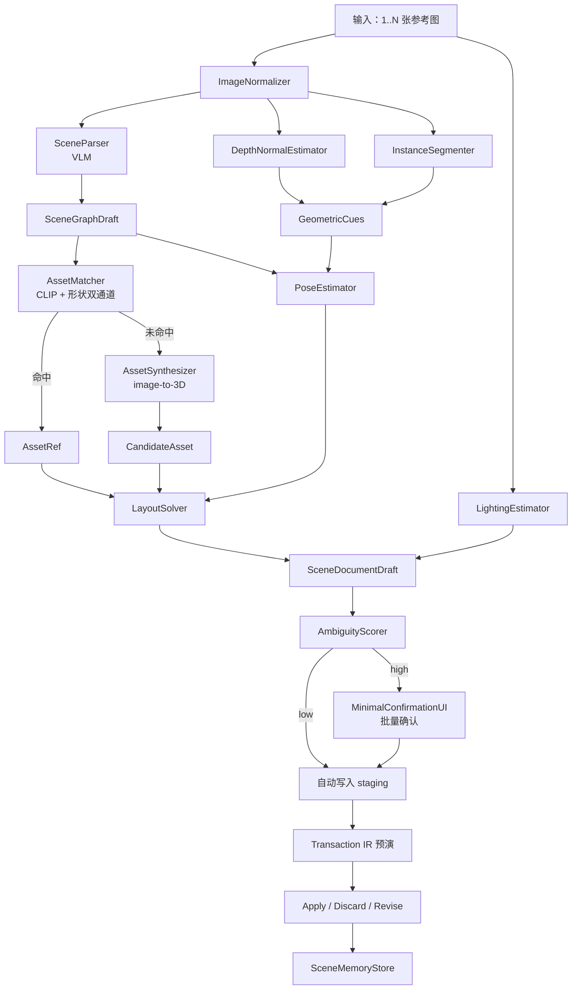

# ReferenceImage Signal：场景草稿生成流水线

> **定位**：本文档描述 `Signal.ReferenceImage` 的处理流水线，对应 `architecture.md` 中 Session 接收参考图输入后生成 Proposal 的过程。
> 适用范围：从一张或多张参考图（手稿、照片、风格图、概念图）到一份可编辑的场景草稿 Proposal。
> 本文档不承诺像素级 3D 重建，承诺的是产出可编辑、可预演、可逐对象替换的场景 Proposal。

---

## 0. 设计前提

1. 输出必须是 canonical `SceneDocument`，不是 NeRF / Gaussian Splatting 等不可编辑表示
2. 所有自动产物 `provenance = inferred`，必须经 Transaction IR 才能落盘
3. 流水线不持有 LLM 提示词技巧，所有模型调用都按"输入图 → 结构化输出"的契约
4. 复用 Phase B.5 的 AmbiguityScorer / MinimalConfirmationUI / SemanticMemoryStore / Provenance 体系
5. 任一后端不可用时整体可降级，不阻断用户

依赖的前置 Phase：B.5（语义生产流水线）、C（CapabilityGraph + Transaction IR）、D（Observation Bus + Memory Index）。

---

## 1. 流水线总览



约束：

- 每个模块产物都带 `provenance` 与 `confidence`
- 任一后端失败只影响其下游对象，不污染整张场景
- 已确认对象进入 `SceneMemoryStore`，下次同图或同布局再次出现时直接复用

---

## 2. 模块职责

### 2.1 ImageNormalizer

输入：原始图（任意分辨率、色彩空间、EXIF 朝向）

输出：`NormalizedImage`

```text
NormalizedImage {
  id, source_uri, width, height,
  color_space: linear_srgb,
  exif_orientation_applied: bool,
  hint: { fov_deg?, focal_mm?, sensor?, tags?[] }
}
```

要点：

- 统一到 linear sRGB
- 修正 EXIF 朝向，避免后续模型重复处理
- EXIF / 用户提供的相机参数透传给 `PoseEstimator`，没有就标记缺失，不猜

### 2.2 SceneParser（VLM 后端）

输入：`NormalizedImage[]` + 可选 user prompt（"卧室 / 工业风 / 阳光"）

输出：`SceneGraphDraft`

```text
SceneGraphDraft {
  scene_kind: indoor | outdoor | studio | abstract
  style_tags: [str]            // industrial / scandi / cyberpunk ...
  objects: [
    {
      slot_id,
      category,                 // chair / lamp / table / character ...
      attributes: { color?, material_hint?, size_hint? },
      relations: [
        { kind: on_top_of | beside | inside | facing, target_slot }
      ],
      visibility: full | occluded | partial,
      bbox_2d: [x,y,w,h]        // 在每张图中的位置
    }
  ]
  unresolved_areas: [{ bbox_2d, reason }]  // VLM 看不清的区域
  global_lighting_hint: { time_of_day?, mood? }
}
```

约束：

- 不让 VLM 直接生成 SceneDocument JSON，输出是中间草稿
- 每个 object 是 **slot**，不是最终 asset
- relations 限制在闭集，VLM 输出非法关系时丢弃并记 diagnostic

### 2.3 DepthNormalEstimator

输入：`NormalizedImage`

输出：`DepthMap`、`NormalMap`

```text
DepthMap {
  per_pixel: float[]
  scale_kind: relative | metric
  metric_scale_hint: optional float   // 如有相机内参
  reliability_mask: float[]           // 弱纹理区低
}
```

要点：

- 默认相对深度，metric 标度只在有相机参数或场景类已知尺寸物体时给出
- 弱纹理区域置信度低，下游不强求该区域产生几何

### 2.4 InstanceSegmenter

输入：`NormalizedImage` + `SceneGraphDraft.objects`

输出：每个 slot 的实例掩码

```text
InstanceMask {
  slot_id, image_id,
  mask_bitmap, area_ratio,
  occlusion_ratio,
  contour_quality: clean | fuzzy | broken
}
```

要点：

- 透明 / 反光物 contour_quality 标记 fuzzy，触发用户确认
- 与 SceneParser 的 bbox_2d 互校验，差异过大丢弃该 slot

### 2.5 GeometricCues

合并 depth + seg + 已知地面假设，产出每个 slot 的几何线索。

```text
GeometricCue {
  slot_id,
  estimated_aabb_3d,
  estimated_up_axis,
  ground_contact: bool,
  symmetry_hint: optional axis,
  scale_anchor: optional { reference_object, reference_size_m }
}
```

scale_anchor 来自类目先验（如门 ≈ 2 m，椅子座面 ≈ 0.45 m），用于把相对深度提升为绝对尺度。无锚点时 scale 标记 unresolved，后续在 LayoutSolver 中按相对关系求解。

### 2.6 AssetMatcher

为每个 slot 找候选资产。

接口：

```text
AssetMatcher {
  match(slot, geometric_cue, image_crop) -> [AssetCandidate]
}
```

双通道检索：

- **语义通道**：CLIP-style image embedding 检索资产库的预渲染缩略图
- **形状通道**：把 GeometricCue 的 aabb + 类目转成 query，检索资产库的形状指纹（沿用 B.5 的 `GeometryFingerprint`）

输出：

```text
AssetCandidate {
  asset_uri,
  match_score,
  match_evidence: { semantic, shape, size_fit },
  thumbnail_uri,
  source: library | family_member | generated
}
```

返回 top-K（默认 K=3），不直接选定。

> 与 §2.4.1 同口径：CLIP embedding 与几何指纹只在检索层流动，发给 LLM 的是 `AssetCandidate` 的符号字段。

### 2.7 AssetSynthesizer

仅在 AssetMatcher 全部候选 `match_score` 低于阈值时调用。

接口：

```text
AssetSynthesizer {
  synthesize(image_crop, mask, geometric_cue, category) -> CandidateAsset
}
```

后端可选：

- TripoSR / Hunyuan3D / Trellis / 其他 image-to-3D 模型
- 输出统一为 GLTF + 占位贴图，进入 `staging/inferred/{asset_id}/`
- 标记 `quality: rough`，几何与材质都不能直接进资产正式库

约束：

- 不替代 AssetMatcher，只兜底
- 生成产物默认不写入资产库，需用户确认升格
- 失败时返回类目对应的 primitive proxy（box / cylinder / capsule），保留 slot 不阻断

### 2.8 PoseEstimator

输入：`GeometricCue` + 选定的 `AssetCandidate` + `DepthMap`

输出：6-DoF 位姿候选

```text
PoseProposal {
  slot_id, asset_uri,
  transform: { translation, rotation, scale },
  confidence,
  ambiguity: optional [transform alternatives]   // 对称物的正反向
}
```

要点：

- 已知 CAD 时用 PnP / render-and-compare
- 未知物用 GeometricCue 的 aabb 对齐，方向由 SceneParser 的 `facing` 关系或 VLM 朝向标签提供
- 对称物保留多解，交给 AmbiguityScorer

### 2.9 LayoutSolver

把所有 PoseProposal + relations 融合为一致布局。

约束求解器目标：

- 满足 `on_top_of` / `inside` / `beside` / `facing` 关系
- 不穿插（碰撞惩罚）
- 接地物贴合 ground plane
- 在多 PoseProposal 中选最一致解

输出：

```text
LayoutSolution {
  placements: [{ slot_id, asset_uri, transform, contact_constraints[] }]
  unresolved_slots: [slot_id]      // 求解失败但保留位置占位
  diagnostics: [...]
}
```

contact_constraints 写入 SceneDocument，使用户后续拖动一个对象时引擎能维持关系。

### 2.10 LightingEstimator

输入：`NormalizedImage` + `SceneGraphDraft.global_lighting_hint`

输出：

```text
LightingProposal {
  env_light: { source: predicted_hdri | solid_color, uri?, intensity }
  main_light: optional { direction, color, intensity, kind: sun | area }
  fill_lights: optional [...]
  confidence
}
```

只给方向与色温，不承诺精确还原。多光源场景下置信度低，强制走确认。

### 2.11 SceneDocumentDraft

把 LayoutSolution + LightingProposal 组装成 SceneDocument 提案。

要点：

- 每个 placement 转为 SceneDocument 的 `instance` 节点，引用 `ModelDocument`
- contact_constraints 写入 instance 的 component
- `unresolved_slots` 保留为 `placeholder` 节点，标记 `kind=unresolved_volume`，不静默丢弃
- 整份 draft 写入 `staging/scene/{draft_id}.scene.json`，未 apply 前不影响正式 scene

### 2.12 复用 B.5 的下游

- `AmbiguityScorer`：复用，阈值表新增 scene 维度（pose_ambiguity_threshold、layout_conflict_margin、lighting_uncertainty_threshold）
- `MinimalConfirmationUI`：复用，问题模板新增三类
  - "这把椅子用 A 还是 B？"（资产候选选择）
  - "桌上的杯子在桌面前缘还是中间？"（位姿二义）
  - "主光从左上还是右上？"（光照二义）
- `SceneMemoryStore`：B.5 SemanticMemoryStore 的扩展，多记 scene 级条目（图像哈希 → 已确认布局 / 已选资产）

---

## 3. 视觉模型协议

视觉后端（VLM、segmenter、depth、image-to-3D）按统一接口接入：

```text
VisionBackend {
  capability: { parse_scene | segment | depth | normal | image_to_3d | clip_embed }
  invoke(NormalizedImage, params) -> StructuredOutput
  health() -> { available, latency_ms, version }
}
```

约束：

- 任一后端可禁用，禁用后流水线在受影响模块上输出 `partial` 状态
- 输出永远是结构化 schema，不允许把"模型自由文本"直接落库
- 不允许后端之间共享隐式上下文，所有跨后端依赖通过流水线显式事件

---

## 4. 失败与降级路径

| 场景 | 降级策略 |
|------|----------|
| VLM 不可用 | 流水线终止于 SceneParser 之前，提示用户"此功能需视觉后端" |
| Segmenter 不可用 | 用 VLM bbox 近似掩码，contour_quality 标记 fuzzy |
| Depth 不可用 | 全部 slot 用 primitive proxy 等比放置，scale 全部标 unresolved |
| AssetMatcher 全部低分 | 调 AssetSynthesizer；仍失败则用 primitive proxy |
| AssetSynthesizer 不可用 | primitive proxy 兜底 |
| PoseEstimator 失败 | 该 slot 走 unresolved_slots，保留位置占位 |
| LayoutSolver 不收敛 | 输出局部最优解，标 diagnostics，不阻断 |
| LightingEstimator 失败 | 用引擎默认 env light，标 inferred=false |
| 场景中物体过多（>N） | 分块处理，按 SceneGraphDraft 的 relations 切子图 |

总原则：**不阻断、不静默、所有 partial 状态对 LLM 与用户均可见**。

---

## 5. 接口契约（事件流）

```text
event ImageIngested            { batch_id, image_ids[] }
event SceneParsed              { batch_id, draft_id }
event GeometricCuesReady       { batch_id, slot_ids[] }
event AssetMatched             { batch_id, slot_id, candidates[] }
event AssetSynthesized         { batch_id, slot_id, candidate_id }
event PoseProposed             { batch_id, slot_id, proposals[] }
event LayoutSolved             { batch_id, solution_id }
event LightingProposed         { batch_id, lighting_id }
event SceneDraftReady          { batch_id, draft_uri }
event ConfirmationRequested    { batch_id, questions[] }
event ConfirmationResolved     { batch_id, confirmations[] }
event SceneDraftCommitted      { batch_id, scene_doc_revision }
```

每个事件携带 `batch_id`，便于诊断与回放。

---

## 6. 符号化输出层

LLM 与用户最终读到的 scene draft 同样按符号 schema 呈现，不暴露 embedding / depth raw。

```text
SceneDraftSymbolicView {
  draft_id, source_images[], style_tags,
  instances: [
    {
      slot_id,
      asset: {
        uri, source: library | generated,
        confidence, alternatives: [{ uri, confidence }]
      },
      transform: { position_m, rotation_deg, scale },
      pose_confidence,
      contacts: [{ kind, target_slot }],
      provenance: inferred
    }
  ],
  unresolved_volumes: [{ slot_id, bbox_m, reason }],
  lighting: { env_summary, main_summary, confidence },
  diagnostics: [...]
}
```

数值带单位，候选裁到 top-K，避免 prompt 膨胀。

---

## 7. 与总纲的对齐

本文档对总纲的修订建议：

1. 第 4 节 Canonical Documents：补充"SceneDocument 可由 Phase F 流水线生成 inferred 草稿"
2. 第 9 节 Scene/Sequence/Model 关系：scene-from-image 草稿在落盘前不进入 SequenceDocument
3. 第 11 节 Transaction IR：scene draft 的 apply 必须作为单事务，allow batch rollback
4. 第 13 节视觉角色：在 Phase F 中视觉是主输入，不是辅助
5. 第 15 节实施顺序：增加 Phase F，依赖 B.5 / C / D

---

## 8. 验收标准

下列条件全部满足，本流水线视为可交付：

1. 给一张室内参考图，5 分钟内产出可在编辑器打开的 SceneDocument 草稿
2. 主要对象（占图面 ≥ 5%）资产命中或生成成功率 ≥ 80%
3. 接地物的 ground_contact 正确率 ≥ 90%
4. 所有 inferred 字段都可通过 Transaction IR 一键回滚
5. 任一视觉后端不可用时，流水线仍能产出退化版草稿（primitive proxy + 默认光照）
6. 同一参考图二次输入时复用 SceneMemoryStore，避免重复生成与重复确认
7. SceneParser 输出的非法 relation 100% 被丢弃且写入 diagnostics

---

## 9. 不在范围

- NeRF / Gaussian Splatting 等不可编辑重建
- 视频输入（留作后续扩展）
- 动态场景（角色动画、粒子）
- 像素级材质还原（SSS / 各向异性 / 复杂 BRDF）
- 多视角自动对齐（多图当前按用户标注同一场景处理，不做 SfM）

---

## 10. 后续待办

- 图像 EXIF / 用户相机参数的导入路径
- 资产库缩略图的标准化渲染（统一光照 / 视角 / 背景）以便 CLIP 检索稳定
- 类目先验库（家具 / 道具 / 角色 / 载具）的尺寸锚点表
- AssetSynthesizer 后端选择策略与质量评估
- LayoutSolver 的约束语言与可调权重
- LightingEstimator 在户外 / HDR 场景的扩展
- SceneMemoryStore 的图像哈希策略（pHash + CLIP 双通道）
