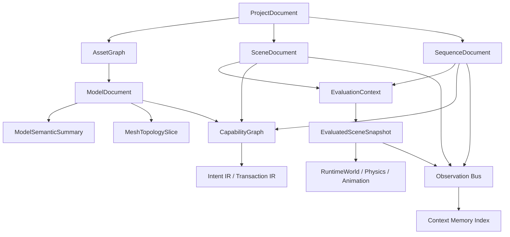
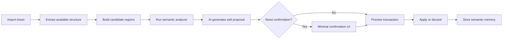

# AI 原生场景与模型理解架构设计

> 本文档定义 Guava 中“AI 如何原生理解项目、场景、模型和编辑器能力”的统一架构。
> 目标读者：引擎实现者、编辑器实现者、未来的 AI 工作流设计者。
> 本文档不讨论提示词技巧，也不把 MCP / JSON 视为核心方案；重点是引擎内部的 canonical model、语义层、事务层和观察层。

---

## 0. 问题定义

当前常见方案里，AI 主要通过两种方式理解场景：

1. 读取 JSON / RPC 返回值
2. 读取 viewport PNG 或屏幕截图

这两种方式都不等于 AI 原生理解。

- JSON / RPC 返回值通常是工具调用结果，不是工程主模型
- PNG 只能提供视觉线索，无法稳定表达对象身份、结构关系、修改作用域、来源和事务语义

Guava 要解决的问题不是“让 AI 会调工具”，而是让 AI 在没有视觉模型参与时，也能直接理解：

- 项目里有哪些 authoring truth
- 一个 scene object / model object 到底是什么
- 一个修改作用在 asset、instance、shot override 还是 runtime projection
- 哪些操作可预演、可回滚、可确认
- 哪些数据来自 authored / evaluated / runtime / baked / inferred

---

## 1. 设计目标

1. AI 读取的是 canonical document 和 derived semantic view，而不是零散 RPC 返回值。
2. AI 能区分 authoring 数据、evaluation 结果、runtime 投影、bake 结果。
3. AI 能理解模型的身份、结构、几何语义、拓扑编辑上下文和场景绑定关系。
4. AI 的写操作默认具备 transaction、preview、approval、rollback 语义。
5. AI 能基于 observation bus 和 memory index 形成持续上下文。

### 1.1 非目标

- 不要求 LLM 直接理解全量原始三角面片
- 不把 PNG 识别当作主理解路径
- 不把 MCP 或 JSON 格式本身当作架构核心
- 不把 ECS world 直接当作编辑器长期存档格式

---

## 2. 核心判断

AI 原生理解的关键不在“视觉更强”，而在“引擎是否维护一套可解释的工程语义模型”。

Guava 中需要明确区分四层：

1. Authoring Truth
2. Derived Semantic Views
3. Runtime Projection
4. AI Interaction Layer

其中：

- Authoring Truth 是长期真相
- Derived Semantic Views 是为 AI 与编辑器服务的可读视图
- Runtime Projection 是当前时间点或当前模式下的求值结果
- AI Interaction Layer 负责 capability、intent、transaction、observation、memory

还需要明确一点：

- `SceneDocument`、`ModelDocument` 这类 document **只解决结构可读和作用域可控**
- document **不会凭空创造语义**
- 如果源模型没有 part、命名、材质分区、骨骼或其他 metadata，系统不能一开始就真的知道“哪里是耳朵”
- 因此 Guava 需要一条 **语义生产流水线**，而不是假设 document 自己就等于理解

AI 真正的理解来自三部分共同成立：

1. canonical document 提供稳定结构与作用域
2. semantic pipeline 从导入结果中生产候选语义
3. 视觉输入为审美判断和歧义消解提供反馈

---

## 3. 架构总览

这张图的约束是：

- `ProjectDocument`、`SceneDocument`、`SequenceDocument`、`AssetGraph`、`ModelDocument` 是长期存在的工程真相
- `EvaluatedSceneSnapshot`、`RuntimeWorld` 是时态相关结果
- `CapabilityGraph`、`Intent IR`、`Transaction IR`、`Observation Bus`、`Context Memory Index` 是 AI 交互层

---

## 4. Canonical Documents

Guava 中 AI 默认读取的不是“工具结果”，而是下面这些 canonical document：

| 文档 | 作用 |
|------|------|
| `ProjectDocument` | 项目配置、目标平台、插件、全局约定 |
| `AssetGraph` | 资产身份、依赖、导入设置、生成物 |
| `SceneDocument` | scene graph、对象稳定 ID、component authoring data、editor metadata |
| `SequenceDocument` | shot、track、clip、binding、camera cut、cache |
| `ModelDocument` | 单个模型的 authoring truth |
| `EditorContext` | 当前 selection、tool mode、viewport、timeline、pending transaction |

设计原则：

1. 每个 document 都有稳定 ID 和 revision。
2. document 是 AI 理解的主入口，不依赖工具调用副作用维持语义。
3. derived view 可以丢弃并重算，但 canonical document 不应丢失作者意图。
4. authored / evaluated / runtime / baked / inferred 的来源必须显式标记。

---

## 5. 模型理解：ModelDocument

`ModelDocument` 是 AI 理解模型的主入口，不是 GPU buffer，也不是运行时 mesh handle。

旧 Zig 代码里，模型主要通过 `MeshHandle`、`primitive`、`material`、`bounds` 暴露，这足够做字段修改，但不足以让 AI 理解模型内部部件语义。新设计必须把模型从“资源句柄”提升为“语义对象文档”。

### 5.1 建议字段

- `model_id`
- `source_asset_uri`
- `import_revision`
- `generator_kind`
- `unit_scale`
- `up_axis`
- `forward_axis`
- `pivot`
- `bounds`
- `lods`
- `nodes[]`
- `parts[]`
- `submeshes[]`
- `material_slots[]`
- `skeleton`
- `bones[]`
- `sockets[]`
- `animations[]`
- `collision_shapes[]`
- `semantic_tags[]`
- `provenance`

### 5.2 设计原则

1. 稳定 ID 优先，不依赖 display name。
2. 资产身份和实例引用分离。
3. 允许 imported / procedural / baked / inferred 共存。
4. 允许后续 editor 标注补充 part-level 语义。

### 5.3 它回答的问题

`ModelDocument` 至少应让 AI 能回答：

- 这个模型来自哪个 asset
- 它由哪些 node / part / submesh 组成
- 哪些 material slot 可独立替换
- 哪些骨骼、socket、动画与它绑定
- 哪些碰撞壳和 LOD 与它对应

---

## 6. 模型理解：ModelSemanticSummary

AI 默认不直接读取全量 topology，而先读取语义摘要。

`ModelSemanticSummary` 应回答：

- 这是一个什么模型
- 有多少 part
- 主要 part 如何组织
- 哪些 part 可能有功能语义（door_handle、wheel、glass_panel、socket）
- 模型的主支撑面、朝向、对称轴是什么
- 哪些区域适合碰撞近似、布料、软体或只读装饰

### 6.1 语义来源

这个视图来自：

1. 源文件结构
2. 导入分析
3. 作者标注
4. 历史操作统计
5. AI 推断（标记为 inferred，不能覆盖 authored truth）

如果这些来源都不足，系统只能得到 **candidate semantics**，不能直接把候选语义当成真相。

### 6.2 作用

`ModelSemanticSummary` 的职责不是替代 `ModelDocument`，而是降低 AI 默认阅读成本。

AI 在多数回合里需要的不是完整模型数据，而是：

- “这是一个 12-part 的机械门”
- “part_03 可能是把手”
- “主支撑面朝 -Y”
- “存在左右对称轴”
- “有 3 个 box hull 可用于碰撞近似”

这类信息更接近“理解”，也更适合作为默认上下文。

### 6.3 Document 与语义生产的边界

`ModelDocument` 保存的是已经被系统明确下来的结构与语义。

它不负责：

- 从零猜出全部部件语义
- 独立完成审美判断
- 替代导入分析与用户确认

因此需要补一条明确的语义生产链：

`DCC / Asset` → `Importer` → `Candidate Region Builder` → `Semantic Analyzer` → `Minimal Confirmation` → `ModelDocument`

这里的关键约束是：

- `ModelDocument` 保存结果
- `Candidate Region Builder` 和 `Semantic Analyzer` 生产候选
- `Minimal Confirmation` 只在歧义点要求用户给最少信号
- 用户不应被迫先做一套完整手工标注

### 6.4 低结构模型的现实约束

对于来自 Maya / Blender 但结构信息很弱的模型，常见情况包括：

- 单一 mesh
- 单一材质
- 没有 node 命名
- 没有 part 分组
- 没有 rig / bones
- 没有 custom metadata

这类资产导入后，系统最多天然知道：

- 几何体
- 材质槽
- bounds
- topology

这时 Guava 不应该假装“已经理解”，而应退回到 **候选区域 + 最小确认** 模式。

---

## 7. 低结构模型的语义生成工作流

本节描述用户导入一个缺少 DCC 原始结构的模型后，系统如何逐步让 AI 获得可用理解。

### 7.1 设计原则

1. 默认自动推断，不要求用户先做完整标注
2. 只在歧义处打断用户
3. 用户每确认一次，系统都应记忆
4. 先支持“改得动”，再追求“完全懂”

### 7.2 工作流总览

### 7.3 Phase A：导入后自动分析

系统先自动做这些事情，不打断用户：

1. 提取已有结构
   - node / object 名
   - submesh
   - material slots
   - skeleton / bones
   - morph targets
   - UV islands
   - connected components
2. 做几何分析
   - 对称轴
   - 主要凸起区域
   - 细长区域
   - 高曲率区域
   - 开口 / 封闭体
   - 主要轮廓
   - 支撑面 / 接地面
   - 候选碰撞壳
3. 生成 `candidate regions`

注意：这一步先不要强行把 region 命名成“耳朵”“眼睛”“尾巴”。先生成可定位、可高亮、可编辑的候选区域。

### 7.4 Phase B：弱语义理解

AI 在这一阶段拿到的是：

- 哪些区域左右对称
- 哪些区域细长突出
- 哪些区域材质独立
- 哪些区域属于单独 connected component
- 哪些区域只支持 material edit，哪些可能支持 topology edit

这时 AI 形成的是 **weak semantic understanding**，例如：

- “顶部两个对称细长区域，可能是耳朵”
- “前部两个小高亮区域，可能是眼睛”
- “后部一个小球状区域，可能是尾巴”

这不是最终真相，但足够进入提案阶段。

### 7.5 Phase C：AI 提案

用户不需要先进标注系统，只需要用自然语言表达目标：

- “让它更可爱”
- “耳朵短一点”
- “材质别这么塑料”
- “像玩偶一点”

系统据此生成一个或多个提案，例如：

- 方案 A：缩短顶部两个对称细长区域 12%
- 方案 B：增大前部两个小圆区域 18%
- 方案 C：降低 roughness，增加毛绒感

### 7.6 Phase D：最小确认

只有当系统判断存在歧义时，才要求用户做最小确认：

- “我理解的耳朵是这两个高亮区域，对吗？”
- “这次修改作用在当前实例，还是模型本体？”
- “我将修改这两个 region，是否继续？”

用户的交互应被压缩到最少：

- 点一下
- 说“对”
- 说“不是，是这里”
- 或切换作用域

Guava 不应要求用户先做一整套手工语义标注。

### 7.7 Phase E：预览与记忆

确认后，系统执行 preview：

- 在视口里高亮将被修改的区域
- 显示修改前后对比
- 允许撤回

如果用户接受，系统把这次确认记住，例如：

- `region_07 -> user_alias = ear_left`
- `region_08 -> user_alias = ear_right`
- `region_11 -> editable_scope = material_only`

以后同一个 asset 再次出现，AI 就不需要从零猜一次。

### 7.8 用户到底需不需要标注

默认不需要完整标注。

当源模型信息不足时，用户有时必须提供 **最小语义信号**，但这不应表现为传统 DCC 式标注工作，而应表现为：

1. 点击确认
2. 自然语言纠正
3. 一次性命名

这也是 Guava 与传统工具链的差异：不是“用户先服务 AI”，而是“AI 先工作，只在必要时请求最小帮助”。

---

## 8. 模型理解：MeshTopologySlice

只有当 AI 需要直接做 mesh 编辑时，才读取 `MeshTopologySlice`。

`MeshTopologySlice` 是局部、分页、上下文相关的拓扑切片，不是全模型三角面导出。

### 8.1 建议内容

- 当前 selection domain：vertex / edge / face
- selected set
- neighborhood rings
- boundary loops
- connected components
- normal groups
- uv islands
- material region
- local bounds
- predicted edit impact

### 8.2 目标

- 让 AI 能理解局部编辑会影响什么
- 避免把全量 triangle soup 暴露给模型
- 让拓扑理解成为按需读取，而不是默认成本

### 8.3 与旧 Zig mesh 编辑的关系

旧 Zig 里 `mesh` RPC 已经有：

- object / edit mode
- vertex / edge / face selection
- extrude / bevel / merge / duplicate / separate

缺的是一个 AI 可读的拓扑中间层。`MeshTopologySlice` 就是补这层，而不是推翻原有 mesh 编辑能力。

---

## 9. Scene / Sequence / Model 的关系

`SceneDocument` 不直接内嵌模型细节，而是引用 `ModelDocument`。

关系应当是：

- `AssetGraph` 管理模型资产身份
- `ModelDocument` 描述模型本体
- `SceneDocument` 描述模型实例、part binding、instance override
- `SequenceDocument` 描述 shot / track / clip 对 scene object 或 model part 的时间域控制

这意味着 AI 必须能区分：

1. 改模型资产本体
2. 改 prefab 定义
3. 改场景实例 override
4. 改某个 shot 局部 override

### 9.1 为什么这很重要

没有这层区分，AI 就无法稳定回答：

- “把这个模型整体缩小”
- “把这个实例缩小”
- “只把这个镜头里的这个实例缩小”
- “只把模型的把手缩小”
- “只把把手选中的面缩进去一点”

这些看起来都像“改模型”，但真实作用域完全不同。

---

## 10. Capability Graph

`docs/api/ai-tools.md` 保留，但降级为执行层参考。

AI 真正依赖的是 `CapabilityGraph`。

### 10.1 每个 capability 至少包含

- `verb`
- `scope`
- `target_kind`
- `preconditions`
- `effects`
- `reversible`
- `preview_support`
- `confirmation_policy`
- `read_after_write`
- `writes_documents`
- `writes_runtime`

### 10.2 示例

- `adjustModelPartTransform`
- `setMaterialOverride`
- `editMeshRegion`
- `createShotOverride`
- `bakePhysicsCache`
- `propagateAssetChangeToInstances`

### 10.3 作用

CapabilityGraph 让 AI 理解的不是“方法名”，而是：

- 这个操作在哪一层工作
- 会影响哪些 document
- 是否可撤销
- 是否必须预演
- 执行后应该回读哪些视图确认

这比单纯的 `entity.setComponentField` 更接近 AI 原生理解。

---

## 11. Intent IR / Transaction IR

AI 不应直接下发最终 RPC 序列。

### 11.1 推荐流程

1. AI 生成 `Intent IR`
2. 系统解析影响范围和前置条件
3. 生成 `Transaction IR`
4. 在 ghost world / preview world 中执行预演
5. 输出 diff、风险、确认要求
6. apply / discard / revise

### 11.2 `Transaction IR` 至少应表达

- operation scope（asset / prefab / scene instance / shot override）
- target object ids
- base revision
- approval policy
- preview result
- rollback handle
- provenance

### 11.3 继承旧 Zig 的部分

旧 Zig 已经有：

- staged transaction
- preview world
- `base_revision`
- `approval`
- intent log / command timeline

新设计应保留这些能力，但把它们从“编辑器特性”提升为“AI interaction layer 的基础协议”。

---

## 12. Observation Bus 与 Context Memory Index

AI 不应依赖每轮全量重拉。

### 12.1 建议统一事件流

- `project.changed`
- `scene.changed`
- `sequence.changed`
- `selection.changed`
- `model.semantic.changed`
- `transaction.staged`
- `transaction.applied`
- `transaction.discarded`
- `asset.import.finished`
- `diagnostics.changed`

### 12.2 `Context Memory Index` 保存的内容

- overview
- focused slice
- last diffs
- unresolved issues
- user intent continuity
- authored / runtime / baked / inferred provenance

### 12.3 为什么 observation 与 memory 必须并存

只做 event stream 不够，因为 AI 仍然会丢失长期上下文。

只做 memory 也不够，因为没有 diff 和 provenance，AI 很难判断当前状态是：

- 作者手动修改的
- 预演生成的
- 运行时临时值
- 烘焙结果
- AI 推断标签

---

## 13. PNG / 视觉输入的角色

PNG、材质球快照、模型 turntable、场景局部截图都应保留，而且随着多模态模型增强，它们会越来越有价值。

但这些视觉输入仍然不是主理解面，而是 **固定的辅助手段**。

### 13.1 适合由视觉输入负责的内容

- 构图
- 光影
- 镜头语言
- 审美反馈
- 屏幕指代消解
- 材质观感分析
- 造型轮廓比较
- 修改前后视觉对比

### 13.2 建议提供的视觉辅助输入

- 材质球预览图
- 模型 turntable snapshot
- 标准三视图或多视角缩略图
- 当前场景 viewport snapshot
- 选中对象高亮图
- 修改前 / 修改后对比图
- region overlay 预览图

### 13.3 不适合由视觉输入单独负责的内容

- 模型身份
- part 结构
- 修改作用域
- transaction 语义
- authoring / runtime / baked provenance

结论：

- 视觉输入是辅助手段
- 语义文档才是主理解面
- 审美判断与语义控制应当协作，而不是互相替代

### 13.4 兔子示例中的双层工作流

用户说：

> 这个兔子不好看，帮我改可爱一点

系统应分成两层工作：

1. **语义控制层**
   - 找到 candidate regions
   - 判断哪些区域可能对应耳朵、眼睛、尾巴
   - 规划作用域、预演、回滚和写入位置
2. **视觉反馈层**
   - 读取材质快照、模型多视角快照、当前 viewport
   - 判断“哪里不好看”
   - 比较修改前后是否更接近“可爱”“玩偶感”“毛绒感”

这意味着 Guava 的目标不是“拒绝视觉”，而是“不要把视觉当成唯一理解来源”。

---

## 14. 旧 Zig 设计的继承关系

Guava 新架构不应推翻旧 Zig 的三项重要能力：

1. MCP resource snapshot
2. staged transaction / preview world
3. intent log / command timeline / command meta

### 14.1 保留项

- `scene://hierarchy`
- `entity://{id}`
- `editor://context`
- `preview://staged`
- `base_revision`
- `approval`
- `intent_log`

### 14.2 升级项

- 从 snapshot 升级到 canonical document
- 从 `Sequence + Track` 升级到 `Sequence + Shot + Clip + Binding`
- 从 `AiTool.description` 升级到 `CapabilityGraph`
- 从资源句柄理解升级到 `ModelDocument + ModelSemanticSummary`

### 14.3 旧代码给出的直接约束

旧 Zig 代码已经证明：

- JSON 和 MCP 不是唯一问题
- 资源快照、上下文、事务预演、revision guard 这些方向是对的
- 真正缺的是高层 authoring model 与模型语义层

---

## 15. 实施顺序

### Phase A — Canonical Documents

- `SceneDocument`
- `SequenceDocument`
- `ModelDocument`

### Phase B — Semantic Views

- `ModelSemanticSummary`
- `SceneHierarchyView`
- `InspectorView`
- `ShotTimelineView`

### Phase B.5 — Semantic Production Pipeline

- `Importer`
- `CandidateRegionBuilder`
- `SemanticAnalyzer`
- `SemanticMemoryStore`
- `MinimalConfirmationUI`

### Phase C — AI Interaction Layer

- `CapabilityGraph`
- `Intent IR`
- `Transaction IR`

### Phase D — Observation / Memory

- `Observation Bus`
- `Context Memory Index`

### Phase E — Tool Surface Rewrite

- 让 RPC / MCP 成为 capability 的执行出口，而不是主认知层

---

## 16. 验收标准

当下面这些问题在 **没有 PNG 时仍能稳定回答**，并且在 **有视觉输入时能进一步优化审美判断**，说明设计开始成立：

1. “这个场景里有哪些 hero asset，它们分别在哪些 shot 被使用？”
2. “这个模型有哪些可单独编辑的 part？”
3. “把这个门把手缩小 15%” 会改 asset、instance 还是 shot override？
4. “当前 cloth 结果来自 authored、runtime sim 还是 baked cache？”
5. “这次编辑是否可预演、可回滚、需不需要确认？”

如果系统仍然只能回答：

- entityId 是多少
- mesh handle 是多少
- `setComponentField` 应该传什么

那说明 Guava 还没有进入 AI-native 理解阶段。

---

## 17. 后续文档拆分建议

这份文档应作为总纲，后续再拆成更细的设计文档：

1. `ModelDocument` 详细设计
2. 低结构模型的 `CandidateRegionBuilder` / `SemanticAnalyzer` 详细设计
3. `MinimalConfirmationUI` 详细设计
4. `SequenceDocument` / `Shot` / `Clip` / `Binding` 详细设计
5. `CapabilityGraph` 详细设计
6. `Observation Bus` 详细设计
7. `Context Memory Index` 详细设计

总纲负责定边界，子文档负责定字段、接口和实现顺序。
