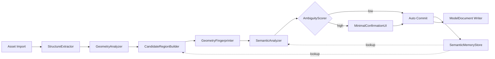

# 资产语义生产流水线

> **定位**：本文档描述资产导入时填充 World `inferred` 层的流水线，对应 `architecture.md` 中 World.Assets.semantic 的生产过程。
>
> 流水线的输出写入 World 的 `inferred` 层（标记 confidence + source），不能覆盖 `authored` 层。Session 通过 World 的 `inferred` 层获得资产的语义理解，不依赖外挂文档。

---

## 0. 设计前提

两类资产对应不同的流水线路径：

1. **结构良好的资产**（有命名 / 分组 / 材质分区 / rig）：纯几何 + metadata 抽取就能产出可用语义，无需视觉模型
2. **结构薄弱的资产**（单 mesh / 无命名 / 无 rig）：几何分析只能产出匿名 region，从 region 到功能语义必须依赖视觉后端或类别先验

两类情况下，所有推断出的语义都标记为 `inferred`，不能覆盖 authored truth。

---

## 1. 流水线总览



约束：

- 每个模块输入输出都是显式数据结构，不依赖隐式上下文
- 每一步产物都带 `provenance`（extracted / analyzed / inferred / confirmed）
- 任何环节都可重跑而不破坏已确认结果
- `SemanticMemoryStore` 通过几何指纹寻址，资产重导入后仍能复用

---

## 2. 模块职责

### 2.1 StructureExtractor

从 importer 输出抽取已存在的结构，不做任何推断。

输入：导入器中间表示（FBX / GLTF / OBJ / Maya / Blender 链路结果）

输出：`RawStructure`

```text
RawStructure {
  nodes:          [{ id, name, parent, transform }]
  meshes:         [{ id, node_id, vertex_count, face_count }]
  submeshes:      [{ id, mesh_id, material_slot, index_range }]
  material_slots: [{ id, name, source_index }]
  skeleton:       optional { bones[], bind_pose }
  morph_targets:  [{ id, name, mesh_id }]
  uv_sets:        [{ mesh_id, channel, island_count }]
  custom_props:   map<string, any>   // DCC 自定义属性原样保留
}
```

设计点：

- 名称只保留，不解析（"ear_L" 不在这里被翻译成耳朵）
- DCC 自定义属性整体透传，不丢字段
- 所有 ID 在本阶段稳定下来，后续模块只引用 ID

### 2.2 GeometryAnalyzer

纯几何信号产出，不涉及语义。

输入：`RawStructure` + 顶点 / 索引缓冲

输出：`GeometrySignals`

```text
GeometrySignals {
  connected_components: [{ id, mesh_id, face_set, bounds }]
  symmetry_axes:        [{ axis, plane, confidence }]
  curvature_clusters:   [{ id, face_set, mean_curvature, area }]
  protrusions:          [{ id, face_set, axis, length, base_radius }]
  cavities:             [{ id, face_set, depth }]
  support_planes:       [{ id, normal, area }]
  uv_islands:           [{ id, mesh_id, face_set, area_ratio }]
  candidate_hulls:      [{ id, face_set, hull_type, error }]
  surface_area:         float
  volume_estimate:      float
}
```

实现要点：

- 对称检测使用 PCA + ICP 验证，confidence 必须导出
- protrusion 基于测地线距离 + 法向偏离阈值
- 所有 face_set 用紧凑位图，避免大面数模型膨胀
- 算法默认运行在 worker pool，不阻塞主线程

### 2.3 CandidateRegionBuilder

把 `RawStructure` 和 `GeometrySignals` 合并成可被 AI 引用的最小单位 `Region`。

输入：`RawStructure` + `GeometrySignals` + `SemanticMemoryStore` 查询结果

输出：`CandidateRegionSet`

```text
Region {
  id:              stable region id
  source:          structural | geometric | memory
  face_set:        bitmap
  bounds:          aabb
  symmetry_group:  optional group_id   // 同组互为镜像
  parent_region:   optional id
  fingerprint:     GeometryFingerprint  // 见 §3
  display_hint:    { centroid, suggested_camera }
}
```

合并策略：

1. 已有 node / submesh → 直接成为 structural region
2. connected component 与已有 structural region 不重叠时 → geometric region
3. 高曲率簇 + protrusion 合并为 candidate part region
4. 对称组配对成 symmetry_group
5. memory 命中的 region 用历史 ID，避免身份漂移

不做的事：

- 不命名"耳朵 / 把手"
- 不做功能语义分类
- 不输出 confidence，confidence 在 `SemanticAnalyzer` 层产出

### 2.4 GeometryFingerprinter

为每个 region 计算稳定指纹，使重导入后仍能匹配 `SemanticMemoryStore`。

输出：`GeometryFingerprint`

```text
GeometryFingerprint {
  shape_descriptor: float[N]   // 旋转/平移/统一缩放不变
  spectral_hash:    bytes      // Laplacian 谱特征量化
  topology_sig:     { genus, boundary_loops, face_count_bucket }
  scale_hint:       float      // 用于解决统一缩放二义
  version:          int
}
```

匹配策略：

- 主匹配 = 描述符余弦距离 + 拓扑签名一致
- 次匹配 = spectral_hash 汉明距离作为兜底
- 阈值参数化，存档于 `SemanticMemoryStore` 元信息
- 版本字段允许后续替换算法而不破坏已存指纹（旧 ↔ 新 通过迁移表对齐）

### 2.5 SemanticAnalyzer

把 region 提升为带语义候选的 `SemanticProposal`。

接口对多种后端开放：

```text
SemanticAnalyzer interface {
  analyze(regions, raw, signals, memory) -> [SemanticProposal]
}
```

内置实现：

| 实现 | 适用 | 输入 | 备注 |
|------|------|------|------|
| `NameHeuristicBackend` | 结构良好资产 | RawStructure.nodes / submeshes / material_slots | 名称模式匹配 + 同义词表 |
| `RigBackend` | 含骨骼资产 | skeleton + bones | 标准骨骼名映射到部位 |
| `MetadataBackend` | DCC custom props | custom_props | 直接读取 authored 标签 |
| `MemoryBackend` | 已学习过的资产族 | memory + fingerprint | 复用历史确认结果 |
| `VisionBackend` | 低结构资产 | turntable 渲染 + region overlay | 视觉模型给候选标签 |
| `CategoryPriorBackend` | 已知类别（人形 / 动物 / 车辆） | 用户提供 category hint | 模板对齐 |

输出：

```text
SemanticProposal {
  region_id:    id
  label:        string             // ear / handle / glass_panel / wheel ...
  confidence:   float [0,1]
  source:       backend_id
  evidence:     [{ kind, weight, detail }]
  alternatives: [{ label, confidence }]
}
```

约束：

- 同一 region 可有多个 backend 给出不同 proposal，进入仲裁
- 仲裁结果由 `AmbiguityScorer` 决定是否需要确认
- `VisionBackend` 必须能离线禁用，便于在无 LLM 环境下退化

### 2.6 AmbiguityScorer

决定一个 proposal 是直接落盘还是触发最小确认。

输入：`SemanticProposal` 列表 + 项目策略

输出：`Decision = AutoCommit | NeedsConfirmation { questions[] }`

判定信号：

- 单 backend、confidence ≥ `auto_threshold` → AutoCommit
- 多 backend 一致 → AutoCommit
- 多 backend 冲突 → NeedsConfirmation，列出冲突标签
- 任意 proposal 涉及破坏性 capability（topology edit、asset 本体改写）→ 强制 NeedsConfirmation
- region 处于已确认 memory 中 → 跳过确认

阈值默认值：

- `auto_threshold`：0.85
- `vision_only_auto_threshold`：0.95（视觉单独来源更保守）
- `conflict_margin`：0.15（top1 与 top2 差小于此值视为冲突）

阈值必须可在 `ProjectDocument` 配置覆盖，不写死。

### 2.7 MinimalConfirmationUI

只在 `AmbiguityScorer` 判定 NeedsConfirmation 时打开。

设计原则：

1. 一次性问完同批次所有歧义，不分多次打断
2. 默认操作可单击完成
3. 视口高亮目标 region，不要求用户阅读列表
4. 提供"我也不确定 / 跳过"出口，跳过的项进入 `pending_review` 队列而不是丢失

输出 `Confirmation` 事件：

```text
Confirmation {
  region_id, accepted_label | rejected | renamed_to,
  user_id, timestamp, scope: asset | instance
}
```

### 2.8 SemanticMemoryStore

跨会话、跨资产复用确认结果。

存储 schema（建议 SQLite + 文件回写）：

```text
table memory_entry {
  fingerprint_hash  TEXT PRIMARY KEY
  asset_uri         TEXT
  region_alias      TEXT
  label             TEXT
  scope             TEXT  -- asset | family | global
  source            TEXT  -- confirmed | inferred
  confidence        REAL
  evidence_blob     BLOB
  created_at, updated_at
}

table memory_family {
  family_id         TEXT PRIMARY KEY
  category_hint     TEXT
  member_assets     JSON
}
```

查询接口：

- `lookup(fingerprint) -> [MemoryEntry]`
- `lookup_family(category, fingerprint) -> [MemoryEntry]`
- `record(confirmation, fingerprint)`
- `migrate(old_fp_version, new_fp_version)`

迁移策略：

- 指纹算法升级时跑离线 batch，把旧 hash 映射到新 hash
- 失败迁移项不删除，标记 `needs_re_fingerprint`，等下次该资产打开时重算

### 2.9 ModelDocument Writer

最终落盘。

约束：

- 所有写入按 `provenance` 标注：`structural` / `geometric` / `inferred` / `confirmed`
- `inferred` 字段不能覆盖 `authored` 字段
- 写入走 Transaction IR，可预演、可回滚
- 写入完成后发 `model.semantic.changed` 事件到 Observation Bus

### 2.10 符号化输出层（LLM 实际可见的视图）

LLM 的输入是结构化 token 记录，不是 ndarray。本节定义 region 在符号层的呈现 schema。

```text
RegionSymbolicView {
  id:              region id
  kind:            structural | geometric_protrusion | geometric_cavity
                  | symmetric_pair | connected_component | uv_island
  bounds:          { center: vec3, size: vec3, unit: "m" }
  axis_hint:       optional { axis, direction }
  length:          optional { value, unit }
  area:            optional { value, unit }
  symmetric_with:  optional region id
  parent_region:   optional region id
  material_slot:   optional id
  candidate_labels:
    - { label, confidence, source }       // 至多 top-3
  memory_hit:      optional {
                     label, source, asset_uri, confidence,
                     last_confirmed_by, last_confirmed_at
                   }
  editable_scope:  [material | transform | topology | bind_only]
  provenance:      structural | geometric | inferred | confirmed
}
```

设计要点：

- 所有数值带单位字符串，避免 LLM 误判尺度
- candidate_labels 限制条数，避免 prompt 膨胀
- memory_hit 显式带 `last_confirmed_by` / `last_confirmed_at`，让 LLM 能区分"用户最近确认"与"很久前的旧标签"
- 同一 ModelDocument 的 region 列表整体作为分页可读资源，不一次性塞 prompt

数据流分层小结：

| 层 | 表征 | 消费者 |
|----|------|--------|
| 检索层 | 高维 float、谱哈希、CLIP embedding | KNN / 向量库 |
| 符号层 | RegionSymbolicView 等结构化记录 | Session（写入 World inferred 层）、Validation 层 |
| 视觉层 | turntable 渲染、region overlay、对比图 | 多模态视觉模型（其输出再回到符号层） |

向量不跨层、图像不跨层，向 LLM 流动的永远是符号。

---

## 3. 几何指纹细节

### 3.1 描述符选择

候选：

- D2 shape distribution（快、对噪声宽容、区分度中等）
- Light Field Descriptor（区分度高、计算贵）
- Spectral signatures（HKS / WKS，旋转不变）

默认采用 D2 + spectral 双通道：D2 做快速召回，spectral 做精排。

### 3.2 失败模式

- 高度对称简单几何（球、立方体）指纹冲突率高 → 仅在有 parent_region 上下文时才接受 memory 命中
- mesh 重新拓扑后描述符漂移 → 通过 `topology_sig` 的 bucket 化容忍小波动，跨 bucket 强制重确认
- LOD 之间几何差异 → 指纹只在 LOD0 上计算，其他 LOD 通过 `lod_chain` 关系映射

### 2.4.1 消费者声明

`GeometryFingerprint` 中的 float 向量与 spectral_hash **不进入 LLM prompt**。它们的唯一消费者是 `SemanticMemoryStore` 的检索算子（KNN / 余弦距离 / 汉明距离）。

LLM 实际看到的是符号化记录，定义见 §2.10。

这一约束适用于本文档定义的所有高维浮点字段：

- `GeometrySignals` 中的连续量（曲率、面积、长度等）以**单位 + 数值**形式出现在符号层，不以 raw vector 形式
- 描述符 / 谱特征只在检索层流动，不出现在任何提示词模板里
- 视觉后端的图像也不直接发给 LLM，发的是视觉模型产出的标签 + 置信度

### 3.3 不可用场景

显式列出当前指纹方案不覆盖的情况，避免被误用：

- 程序化生成、每次种子不同的 mesh
- 大量小碎片组合的 instanced 资产
- 仅靠贴图区分语义的平面 mesh

这些场景下 memory 命中应直接关闭，回退到全量分析。

---

## 4. 失败与降级路径

| 场景 | 降级策略 |
|------|----------|
| `VisionBackend` 不可用 | 仅保留 region，label 留空，标记 `pending_semantic` |
| 几何分析超时 | 输出已完成的 signals，未完成项标记 `partial`，AI 阅读时显式可见 |
| 指纹版本不匹配且迁移失败 | memory 视为缺失，重走完整流程，不阻断用户 |
| 用户拒绝所有候选 | 进入 `manual_label_required`，AI 不应继续主动猜 |
| 资产损坏 | 流水线在 StructureExtractor 阶段终止，发 `asset.import.failed`，不污染下游 |

总原则：流水线任何一步失败都应**有可读的失败状态**，不能静默吞掉。

---

## 5. 接口契约

模块间只通过下列消息交互，不共享可变状态：

```text
event AssetImported          { asset_uri, raw_structure_id }
event GeometryAnalyzed       { asset_uri, signals_id }
event RegionsBuilt           { asset_uri, region_set_id }
event SemanticProposed       { asset_uri, proposals[] }
event ConfirmationRequested  { batch_id, questions[] }
event ConfirmationResolved   { batch_id, confirmations[] }
event SemanticCommitted      { asset_uri, model_doc_revision }
```

每个事件携带 `correlation_id`，串联同一资产的整条流水线，便于诊断与回放。

---

## 6. 与总纲的对齐

本文档对总纲第 6、7、13 节的修订建议：

1. 第 6 节补充：`ModelSemanticSummary` 中区分 `structural_parts` 与 `inferred_parts`，前者来自 RawStructure，后者来自 SemanticAnalyzer
2. 第 7 节将"weak semantic understanding"明确归属 `SemanticAnalyzer` 的 vision / prior backend
3. 第 13 节补充：vision 在低结构资产语义生产中是事实主力之一，不仅是审美辅助
4. 第 11.2 节 Transaction IR 的 `provenance` 字段需对接本流水线的 `source` 标签
5. Phase B.5 实施顺序固定为：Structure → Geometry → Region → Fingerprint → Semantic → Ambiguity → UI → Memory → Writer

---

## 7. 验收标准

下列条件全部满足，本流水线视为可交付：

1. 结构良好资产（如带命名分组的 GLTF）能在不启用 VisionBackend 时产出完整 part 标签
2. 单 mesh、无命名的资产能在 VisionBackend 启用时产出至少 70% region 的候选标签
3. 同一资产重导入（拓扑微调内）能复用至少 90% 历史确认
4. 任一 backend 不可用时，流水线整体仍能完成到 RegionsBuilt
5. 任一确认歧义都能在单一 UI 批次内一次性消解
6. 所有 inferred 字段在 ModelDocument 中可被 authored 数据覆盖且不丢失原值

---

## 8. 后续待办

- D2 + spectral 描述符的离线评测集
- VisionBackend 的最小提示协议与渲染规范
- 类别先验库（人形 / 动物 / 家具 / 车辆）的来源与维护
- MinimalConfirmationUI 的可访问性与键盘流
- 跨项目 memory 共享的隐私与许可边界
