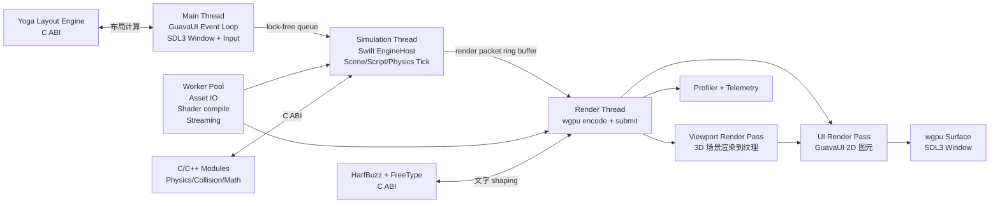

# Engine 重写蓝图（Swift + wgpu + C/C++）

## 0. 决策摘要

- 引擎主体语言：Swift。
- 性能敏感模块：C/C++，通过 C ABI 接入（首选稳定方案）。
- 渲染抽象：wgpu。
- 编辑器 UI：GuavaUI（自渲染，wgpu 后端），跨平台。
- 布局引擎：Yoga（Facebook，C，MIT），通过 C ABI 接入。
- 文字渲染：HarfBuzz + FreeType（跨平台），macOS 可选 CoreText 加速。
- 窗口层：SDL3（跨平台窗口创建与输入事件）。
- 首发平台：macOS，架构保留 Windows / Linux / iOS 扩展位。

### 0.1 UI 方案选型历程

| 方案 | 尝试结果 | 放弃原因 |
|------|----------|----------|
| Zig + ImGui | 已实现 | C++ 绑定维护成本高，ImGui 样式调试困难 |
| Electron | 已实现 | 浏览器渲染进程与 Zig 引擎进程无法零拷贝，viewport 无法 240fps |
| 自定义 CEF | 已验证 | 同 Electron，跨进程共享 surface 存在相同瓶颈 |
| Qt | 已验证 | 许可协议不可接受 |
| Avalonia | 已验证 | 生态薄弱，dock 样式问题无法解决 |
| SwiftUI / AppKit | 设计阶段 | 不跨平台，锁死 Apple 生态 |
| GuavaUI（自渲染） | **当前方案** | 与引擎共享 wgpu 实例，零拷贝，跨平台，完全可控 |

## 1. 架构总览



线程职责：

1. Main Thread
- 运行 GuavaUI 事件循环（SDL3 事件泵）。
- 处理输入事件、hit test、命令派发。
- 调用 Yoga 计算布局（布局脏标记优化，非每帧重算）。
- 不阻塞等待 GPU。

2. Simulation Thread
- 执行 tick：输入消费、物理、脚本、场景状态快照。
- 调用 C/C++ 模块。

3. Render Thread
- 从环形缓冲读取 RenderPacket。
- 先执行 Viewport Render Pass（3D 场景渲染到离屏纹理）。
- 再执行 UI Render Pass（GuavaUI 2D 图元 + viewport 纹理采样）。
- 编码 wgpu 命令并 present 到 SDL3 窗口 surface（零 CPU 回读）。

4. Worker Pool
- 资源加载、后台编译、异步任务。

Swift 与 C++ 边界：

1. 保持 POD 结构体边界。
2. 所有跨边界容器使用指针 + 长度，不传 std::vector。
3. 内存规则：谁分配谁释放，跨边界必须有 free 函数。

## 2. 跨语言接口实现（C ABI 稳定方案）

### 2.1 文件结构（Phase 0 可运行骨架）

- EnginePrototype/
- EnginePrototype/Package.swift
- EnginePrototype/Sources/EngineHost/EngineHost.swift
- EnginePrototype/Sources/Bridge/PhysicsBridge.swift
- EnginePrototype/Sources/CPhysicsBridge/include/bridge.h
- EnginePrototype/Sources/CPhysicsBridge/bridge.cpp
- EnginePrototype/Sources/EditorApp/main.swift
- EnginePrototype/Sources/Viewport/ViewportRepresentable.swift
- EnginePrototype/Sources/RenderBackend/WGPUBackend.swift
- EnginePrototype/Sources/RenderBackend/CHeaders/wgpu.h
- EnginePrototype/Scripts/bootstrap.sh

### 2.2 C++ 头文件（完整示例）

文件：Sources/CPhysicsBridge/include/bridge.h

```c
#ifndef PHYSICS_BRIDGE_H
#define PHYSICS_BRIDGE_H

#include <stdint.h>

#ifdef __cplusplus
extern "C" {
#endif

typedef struct Vec3 {
    float x;
    float y;
    float z;
} Vec3;

typedef struct RigidBody {
    Vec3 position;
    Vec3 velocity;
    float inverse_mass;
} RigidBody;

// 1) 初始化物理上下文，返回句柄
void* physics_create_world(void);

// 2) 固定步长更新
void physics_step_world(void* world, float dt, RigidBody* bodies, uint32_t body_count);

// 3) 销毁上下文
void physics_destroy_world(void* world);

#ifdef __cplusplus
}
#endif

#endif
```

文件：Sources/CPhysicsBridge/bridge.cpp

```cpp
#include "bridge.h"
#include <vector>

struct PhysicsWorld {
    Vec3 gravity;
};

void* physics_create_world(void) {
    PhysicsWorld* w = new PhysicsWorld();
    w->gravity = {0.0f, -9.81f, 0.0f};
    return reinterpret_cast<void*>(w);
}

void physics_step_world(void* world, float dt, RigidBody* bodies, uint32_t body_count) {
    if (!world || !bodies || body_count == 0) return;
    PhysicsWorld* w = reinterpret_cast<PhysicsWorld*>(world);

    for (uint32_t i = 0; i < body_count; ++i) {
        RigidBody& b = bodies[i];
        if (b.inverse_mass <= 0.0f) continue;

        b.velocity.x += w->gravity.x * dt;
        b.velocity.y += w->gravity.y * dt;
        b.velocity.z += w->gravity.z * dt;

        b.position.x += b.velocity.x * dt;
        b.position.y += b.velocity.y * dt;
        b.position.z += b.velocity.z * dt;
    }
}

void physics_destroy_world(void* world) {
    PhysicsWorld* w = reinterpret_cast<PhysicsWorld*>(world);
    delete w;
}
```

### 2.3 Swift 调用侧（完整示例）

文件：Sources/Bridge/PhysicsBridge.swift

```swift
import Foundation
import CPhysicsBridge

public struct Body {
    public var px: Float
    public var py: Float
    public var pz: Float
    public var vx: Float
    public var vy: Float
    public var vz: Float
    public var inverseMass: Float

    public init(px: Float, py: Float, pz: Float, vx: Float, vy: Float, vz: Float, inverseMass: Float) {
        self.px = px
        self.py = py
        self.pz = pz
        self.vx = vx
        self.vy = vy
        self.vz = vz
        self.inverseMass = inverseMass
    }
}

public final class PhysicsBridge {
    private var world: UnsafeMutableRawPointer?

    public init() {
        self.world = physics_create_world()
    }

    deinit {
        if let w = world {
            physics_destroy_world(w)
        }
    }

    public func step(dt: Float, bodies: inout [Body]) {
        guard let w = world, !bodies.isEmpty else { return }

        var raw: [RigidBody] = bodies.map {
            RigidBody(
                position: Vec3(x: $0.px, y: $0.py, z: $0.pz),
                velocity: Vec3(x: $0.vx, y: $0.vy, z: $0.vz),
                inverse_mass: $0.inverseMass
            )
        }

        raw.withUnsafeMutableBufferPointer { buf in
            guard let ptr = buf.baseAddress else { return }
            physics_step_world(w, dt, ptr, UInt32(buf.count))
        }

        for i in raw.indices {
            bodies[i].px = raw[i].position.x
            bodies[i].py = raw[i].position.y
            bodies[i].pz = raw[i].position.z
            bodies[i].vx = raw[i].velocity.x
            bodies[i].vy = raw[i].velocity.y
            bodies[i].vz = raw[i].velocity.z
        }
    }
}
```

内存管理规则：

1. world 由 C++ 分配，Swift 持有句柄，deinit 时调用 destroy。
2. bodies 数组由 Swift 分配与回收，不跨边界持久持有。
3. 不返回 std::vector，统一使用 pointer + count。

## 3. wgpu 在 Swift 中的集成

## 3.1 方案对比

方案 A：直接调用 wgpu-native C API

- 优点：稳定、可控、跨平台一致。
- 优点：可与 SwiftPM C target 直接集成。
- 风险：API 偏底层，样板代码多。

方案 B：使用 swift-webgpu 绑定

- 优点：Swift 语义更自然。
- 优点：开发体验更好。
- 风险：绑定成熟度与 API 演进同步存在不确定性。

推荐：

1. 生产路径优先方案 A（C API）。
2. 研发效率路径可并行验证方案 B。

选择条件：

1. 若 2 周内绑定无法稳定跑通三角形与离屏纹理，回退方案 A。
2. 若绑定稳定且 API 覆盖满足需求，再切入方案 B。

## 3.2 最小可运行示例（Phase 0）

说明：下面示例是可编译工程骨架，前提是已安装 wgpu-native 并提供 wgpu.h 与动态库路径。

文件：Package.swift

```swift
// swift-tools-version: 6.0
import PackageDescription

let package = Package(
    name: "EnginePrototype",
    platforms: [.macOS(.v14)],
    products: [
        .executable(name: "EditorApp", targets: ["EditorApp"])
    ],
    targets: [
        .target(
            name: "CPhysicsBridge",
            path: "Sources/CPhysicsBridge",
            publicHeadersPath: "include",
            cxxSettings: [.headerSearchPath("include")]
        ),
        .target(
            name: "RenderBackend",
            path: "Sources/RenderBackend",
            cSettings: [.headerSearchPath("CHeaders")],
            linkerSettings: [
                .unsafeFlags(["-L", "/usr/local/lib", "-lwgpu_native"])
            ]
        ),
        .target(name: "Bridge", dependencies: ["CPhysicsBridge"]),
        .target(name: "EngineHost", dependencies: ["Bridge", "RenderBackend"]),
        .target(name: "Viewport", dependencies: ["EngineHost", "RenderBackend"]),
        .executableTarget(name: "EditorApp", dependencies: ["EngineHost", "Viewport", "RenderBackend"])
    ]
)
```

文件：Sources/RenderBackend/WGPUBackend.swift

```swift
import Foundation
import QuartzCore
import Metal

public protocol RenderBackend {
    func initialize(layer: CAMetalLayer)
    func renderTriangle(frameIndex: UInt64)
}

public final class WGPUBackend: RenderBackend {
    private weak var layer: CAMetalLayer?
    private var device: MTLDevice?

    public init() {}

    public func initialize(layer: CAMetalLayer) {
        self.layer = layer
        self.device = MTLCreateSystemDefaultDevice()
        layer.device = device
        layer.pixelFormat = .bgra8Unorm
        layer.framebufferOnly = true
        layer.isOpaque = true
    }

    public func renderTriangle(frameIndex: UInt64) {
        guard let drawable = layer?.nextDrawable() else { return }

        // Phase 0 占位：先确保 surface 直接 present 路径打通。
        // 实际 wgpu 编码在接入 wgpu-native 后替换这里。
        _ = frameIndex
        drawable.present()
    }
}
```

说明：

1. 上面先跑通同进程零拷贝 present 路径。
2. 真正 wgpu 命令编码在替换 WGPUBackend 时完成。

## 4. 主循环与线程模型

文件：Sources/EngineHost/EngineHost.swift

```swift
import Foundation
import QuartzCore
import Metal
import Bridge
import RenderBackend

public final class EngineHost {
    public struct FrameTiming {
        public var deltaTime: Float
        public var frameIndex: UInt64
    }

    private let physics = PhysicsBridge()
    private let renderer: RenderBackend

    private let simQueue = DispatchQueue(label: "engine.sim.queue", qos: .userInteractive)
    private let renderQueue = DispatchQueue(label: "engine.render.queue", qos: .userInteractive)

    private var running = false
    private var frameIndex: UInt64 = 0
    private var bodies: [Body] = [Body(px: 0, py: 10, pz: 0, vx: 1, vy: 0, vz: 0, inverseMass: 1)]

    // 双缓冲命令包（主线程写，渲染线程读）
    private var packets: [RenderPacket] = [.init(), .init()]
    private var writeIndex = 0
    private var readIndex = 1
    private let lock = OSAllocatedUnfairLock(initialState: 0)

    public init(renderer: RenderBackend) {
        self.renderer = renderer
    }

    public func initialize(layer: CAMetalLayer) {
        renderer.initialize(layer: layer)
    }

    public func start() {
        guard !running else { return }
        running = true

        let timer = DispatchSource.makeTimerSource(queue: simQueue)
        timer.schedule(deadline: .now(), repeating: .milliseconds(4), leeway: .microseconds(200))

        var last = DispatchTime.now().uptimeNanoseconds

        timer.setEventHandler { [weak self] in
            guard let self, self.running else { return }
            let now = DispatchTime.now().uptimeNanoseconds
            let dt = Float(now - last) / 1_000_000_000.0
            last = now
            self.tick(deltaTime: dt)
        }

        timer.resume()
    }

    public func stop() {
        running = false
    }

    public func tick(deltaTime: Float) {
        // 输入处理 -> 物理/脚本更新（此处演示物理）
        physics.step(dt: deltaTime, bodies: &bodies)

        // 生成 render packet
        var packet = RenderPacket()
        packet.frameIndex = frameIndex
        packet.objectX = bodies[0].px

        lock.withLock { _ in
            packets[writeIndex] = packet
            swap(&writeIndex, &readIndex)
        }

        // 渲染线程异步提交，不阻塞主循环
        renderQueue.async { [weak self] in
            guard let self else { return }
            let p: RenderPacket = self.lock.withLock { _ in self.packets[self.readIndex] }
            self.renderer.renderTriangle(frameIndex: p.frameIndex)
        }

        frameIndex += 1
    }
}

public struct RenderPacket {
    public var frameIndex: UInt64 = 0
    public var objectX: Float = 0
    public init() {}
}
```

## 5. 零拷贝视口验证方案

压测场景：

1. SDL3 窗口中，GuavaUI 渲染编辑器面板，viewport 区域显示动态立方体（Phase 0 先 triangle/clear，Phase 1 上 cube）。
2. 3D 场景渲染到 wgpu 纹理，GuavaUI 在 DockContainer 的 viewport 面板中采样该纹理。
3. 严禁 CPU readback。
4. 记录 FPS、CPU 占用、主线程阻塞时间。

文件：Sources/Platform/SDLWindowBackend.swift

```swift
import Foundation
import CSDL3

public final class SDLWindowBackend {
    private var window: OpaquePointer?
    private var running = false

    public init(title: String, width: Int32, height: Int32) {
        SDL_Init(SDL_INIT_VIDEO | SDL_INIT_EVENTS)
        window = SDL_CreateWindow(
            title,
            width, height,
            SDL_WINDOW_RESIZABLE | SDL_WINDOW_HIGH_PIXEL_DENSITY
        )
    }

    deinit {
        if let w = window { SDL_DestroyWindow(w) }
        SDL_Quit()
    }

    /// 返回用于创建 wgpu surface 的原生窗口句柄
    public func nativeHandle() -> UnsafeMutableRawPointer? {
        guard let w = window else { return nil }
        return SDL_GetPointerProperty(
            SDL_GetWindowProperties(w),
            SDL_PROP_WINDOW_COCOA_WINDOW_POINTER, nil
        )
    }

    public func runEventLoop(onEvent: (SDL_Event) -> Void, onTick: () -> Void) {
        running = true
        while running {
            var event = SDL_Event()
            while SDL_PollEvent(&event) {
                if event.type == SDL_EVENT_QUIT.rawValue {
                    running = false
                    return
                }
                onEvent(event)
            }
            onTick()
        }
    }

    public func stop() { running = false }
}
```

文件：Sources/EditorApp/main.swift

```swift
import Foundation
import EngineHost
import RenderBackend
import Platform
import GuavaUI

let windowBackend = SDLWindowBackend(title: "Guava Editor", width: 1600, height: 900)
let wgpuBackend = WGPUBackend()
let engineHost = EngineHost(renderer: wgpuBackend)
let uiRenderer = UIRenderer(device: wgpuBackend.device)
let dockModel = DockModel.defaultEditorLayout()

// 使用窗口原生句柄创建 wgpu surface
if let handle = windowBackend.nativeHandle() {
    wgpuBackend.createSurface(windowHandle: handle)
}

engineHost.start()

windowBackend.runEventLoop(
    onEvent: { event in
        // SDL 事件 → GuavaUI 事件转换 → hit test → 派发
        uiRenderer.dispatchEvent(SDLEventAdapter.convert(event))
    },
    onTick: {
        // 1. 引擎 tick（simulation + render 3D 场景到纹理）
        engineHost.tick()

        // 2. GuavaUI 布局计算（dirty 时才重算）
        dockModel.layoutIfNeeded()

        // 3. GuavaUI 2D 渲染（包含 viewport 纹理采样）
        uiRenderer.render(root: dockModel.rootNode, viewportTexture: engineHost.viewportTexture)

        // 4. present
        wgpuBackend.present()
    }
)
```

验证命令：

1. 运行：swift run EditorApp
2. 帧率采样（macOS）：xcrun xctrace record --template "Metal System Trace" --time-limit 10s --launch -- swift run EditorApp
3. CPU 占用：sample EditorApp 5 1

## 6. 任务分解（2 天粒度，可并行）

| 阶段 | 任务 | 产出文件路径 | 代码行数预估 | 前置任务 | 自动化测试命令 |
|---|---|---|---:|---|---|
| Phase 0 (3天) | P0-T1 建立 SwiftPM 工程骨架 | Package.swift | 120 | 无 | swift build |
| Phase 0 | P0-T2 C ABI 物理桥接最小跑通 | Sources/CPhysicsBridge/* + Sources/Bridge/PhysicsBridge.swift | 220 | P0-T1 | swift test --filter PhysicsBridgeTests |
| Phase 0 | P0-T3 SDL3 窗口 + wgpu surface 创建 | Sources/Platform/SDLWindowBackend.swift | 180 | P0-T1 | swift run EditorApp |
| Phase 1 (5天) | P1-T1 wgpu-native C API 接入 | Sources/RenderBackend/CHeaders/wgpu.h + WGPUBackend.swift | 380 | P0-T1 | swift test --filter WGPUInitTests |
| Phase 1 | P1-T2 主循环单线程验证 | Sources/EngineHost/EngineHost.swift | 260 | P0-T2 | swift test --filter EngineTickTests |
| Phase 1 | P1-T3 三角形渲染 + 红色清屏 | Sources/RenderBackend/WGPUBackend.swift | 300 | P1-T1 | swift test --filter TriangleRenderTests |
| Phase 2 (7天) | P2-T1 渲染线程拆分与环形缓冲 | Sources/EngineHost/EngineHost.swift | 280 | P1-T2 | swift test --filter RenderThreadTests |
| Phase 2 | P2-T2 GuavaUI 最小原型（矩形 + 文字） | Sources/GuavaUI/* | 600 | P1-T3 | swift test --filter UIRenderTests |
| Phase 2 | P2-T3 Yoga 布局集成 + 基础 widget | Sources/GuavaUI/Layout/* + Sources/GuavaUI/Widgets/* | 500 | P2-T2 | swift test --filter LayoutTests |
| Phase 3 (7天) | P3-T1 DockContainer + 拖拽分割 | Sources/GuavaUI/Dock/* | 450 | P2-T3 | swift test --filter DockTests |
| Phase 3 | P3-T2 240fps 视口压测 | Tests/Performance/Viewport240FPSTests.swift | 200 | P3-T1 | swift test --filter Viewport240FPSTests |
| Phase 3 | P3-T3 输入-物理-渲染链路联测 | Tests/Integration/EngineLoopIntegrationTests.swift | 260 | P2-T1 | swift test --filter EngineLoopIntegrationTests |
| Phase 4 (持续) | P4-T1 场景系统迁移 | Sources/EngineHost/Scene/* | 600+ | P3-T3 | swift test --filter SceneMigrationTests |
| Phase 4 | P4-T2 资源系统迁移 | Sources/EngineHost/Assets/* | 700+ | P4-T1 | swift test --filter AssetPipelineTests |
| Phase 4 | P4-T3 Zig 逻辑替换收尾 | Sources/EngineHost/**/* | 1000+ | P4-T2 | swift test |

## 7. 风险与缓解（含代码）

## 风险 1：Swift 与 C++ 生命周期错配

缓解：句柄封装 + 明确销毁路径。

```swift
final class NativeHandleBox {
    private var ptr: UnsafeMutableRawPointer?
    init(_ ptr: UnsafeMutableRawPointer?) { self.ptr = ptr }
    deinit {
        if let p = ptr { physics_destroy_world(p) }
        ptr = nil
    }
}
```

## 风险 2：wgpu Swift 绑定稳定性不足

缓解：双实现开关。

```swift
enum RenderBackendKind {
    case cAPI
    case swiftBinding
}

func makeBackend(_ kind: RenderBackendKind) -> RenderBackend {
    switch kind {
    case .cAPI: return WGPUBackend()
    case .swiftBinding: return WGPUBackend() // 后续替换为绑定实现
    }
}
```

## 风险 3：渲染线程与 UI 线程同步争用

缓解：OSAllocatedUnfairLock 只保护索引，数据双缓冲。

```swift
let lock = OSAllocatedUnfairLock(initialState: 0)
var packets: [RenderPacket] = [.init(), .init()]
var writeIndex = 0
var readIndex = 1
```

## 风险 4：240fps 下 CPU 占用过高

缓解：固定步长 + 可配置帧预算与跳帧策略。

```swift
if deltaTime > 0.02 {
    // 防止长帧导致模拟爆炸
    tick(deltaTime: 0.02)
} else {
    tick(deltaTime: deltaTime)
}
```

## 8. 一键脚本（最小原型）

文件：Scripts/bootstrap.sh

```bash
#!/usr/bin/env bash
set -euo pipefail

ROOT_DIR="$(cd "$(dirname "$0")/.." && pwd)"
cd "$ROOT_DIR"

# 1) 依赖检查
command -v swift >/dev/null 2>&1 || { echo "swift not found"; exit 1; }
command -v cmake >/dev/null 2>&1 || { echo "cmake not found"; exit 1; }

# 2) 拉取并构建 wgpu-native（示例路径）
if [ ! -d third_party/wgpu-native ]; then
  git clone https://github.com/gfx-rs/wgpu-native.git third_party/wgpu-native
fi

cmake -S third_party/wgpu-native -B third_party/wgpu-native/build -DCMAKE_BUILD_TYPE=Release
cmake --build third_party/wgpu-native/build -j

# 3) 拉取并构建 SDL3
if [ ! -d third_party/SDL ]; then
  git clone https://github.com/libsdl-org/SDL.git third_party/SDL
fi

cmake -S third_party/SDL -B third_party/SDL/build -DCMAKE_BUILD_TYPE=Release
cmake --build third_party/SDL/build -j

# 4) 拉取并构建 Yoga layout engine
if [ ! -d third_party/yoga ]; then
  git clone https://github.com/aspect-build/rules_yoga.git third_party/yoga
fi

# 5) 安装头文件与库到本地路径（示例）
mkdir -p /usr/local/include /usr/local/lib || true
cp third_party/wgpu-native/ffi/webgpu.h /usr/local/include/wgpu.h || true
cp third_party/wgpu-native/build/libwgpu_native.* /usr/local/lib/ || true

# 4) 构建并运行最小原型
swift build
swift run EditorApp
```

## 9. Phase 0 验收标准

1. 命令 swift build 成功。
2. 命令 swift run EditorApp 可打开 SDL3 窗口并持续渲染。
3. 命令 swift test --filter PhysicsBridgeTests 通过。
4. xctrace 报告中无 CPU readback 路径。
5. 窗口内可见 wgpu 渲染输出（红色清屏或三角形）。

## 10. 备注

如果你要求第一天就“完全 wgpu 三角形渲染”，建议保留两条并行路径：

1. 路径 A：先跑 SDL3 窗口 + wgpu surface 零拷贝 present，确保同进程视口链路稳定。
2. 路径 B：并行打通 wgpu-native C API 三角形。

当路径 B 完成后，替换路径 A 的占位渲染实现。

GuavaUI 框架的详细设计参见 [guava-ui-blueprint.md](guava-ui-blueprint.md)。