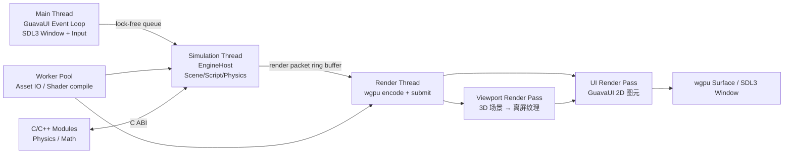

# Engine 蓝图（Swift + wgpu + C/C++）

## 0. 决策摘要

| 项目 | 选型 |
|------|------|
| 主语言 | Swift |
| 性能敏感模块 | C/C++，C ABI 接入 |
| 渲染抽象 | wgpu-native（跨平台，Metal / D3D12 / Vulkan） |
| 窗口与输入 | SDL3 |
| 布局引擎 | 不在 Engine 层，归属 GuavaUI |
| 首发平台 | macOS，保留 Windows / Linux 扩展位 |

### 0.1 UI 方案历史

| 方案 | 状态 | 放弃原因 |
|------|------|----------|
| Zig + ImGui | 已实现 | C++ 绑定维护成本高 |
| Electron | 已实现 | 跨进程无法零拷贝，viewport 无法 240fps |
| 自定义 CEF | 已验证 | 同 Electron |
| Qt | 已验证 | 许可协议不可接受 |
| Avalonia | 已验证 | 生态薄弱，dock 问题无解 |
| SwiftUI / AppKit | 已验证 | 不跨平台，锁死 Apple 生态 |
| GuavaUI（自渲染）| **当前方案** | 与引擎共享 wgpu 实例，零拷贝，跨平台，完全可控 |

---

## 1. 架构总览



### 1.1 线程职责

| 线程 | 职责 |
|------|------|
| Main | SDL3 事件泵、GuavaUI hit-test、命令派发、Yoga 布局 |
| Simulation | 输入消费、物理、脚本、场景状态快照 |
| Render | 环形缓冲读取 RenderPacket，Viewport 3D pass → UI 2D pass → present |
| Worker Pool | 资源加载、Shader 编译、异步任务 |

### 1.2 Swift / C 边界规则

1. 边界数据类型只用 POD 结构体。
2. 跨边界容器用指针 + 长度，不传 `std::vector`。
3. 谁分配谁释放，跨边界必须有对应 `free_*` 函数。
4. 错误用返回码，不抛 C++ 异常。

---

## 2. 目录结构

```
Engine/
├── Package.swift
├── Sources/
│   ├── EngineKernel/          # 核心协议与类型（无外部依赖）
│   │   ├── EngineKernel.swift      # EngineKernel 协议
│   │   ├── InputEvent.swift        # 输入事件类型
│   │   └── InGameUIProviding.swift # GuavaUI 反向注入协议
│   ├── RHIWGPU/               # wgpu RHI 绑定（底层 GPU API 封装）
│   ├── PlatformShell/         # SDL3 窗口与输入
│   ├── RenderBackend/         # 高层渲染管线抽象
│   ├── SceneRuntime/          # 场景图 / ECS（待实现）
│   ├── AssetPipeline/         # 资产加载（MeshAsset / OBJ 已实现）
│   ├── ScriptRuntime/         # 脚本 VM（待实现）
│   ├── EngineCore/            # EngineHost 编排
│   └── Bridge/
│       ├── CEngineBridge/     # 引擎 C ABI stubs
│       ├── CWGPUBridge/       # wgpu-native C 桥
│       └── CSDL3/             # SDL3 系统库 shim
├── vendor/wgpu/               # wgpu-native 预编译库（不提交 .dylib）
└── scripts/
    └── fetch-wgpu.sh          # 下载 wgpu-native 预编译包
```

---

## 3. C ABI 集成规范

### 3.1 头文件约定

```c
// Engine/Sources/Bridge/CEngineBridge/include/engine_bridge.h
#ifndef ENGINE_BRIDGE_H
#define ENGINE_BRIDGE_H
#include <stdint.h>

#ifdef __cplusplus
extern "C" {
#endif

void engine_init(void);
void engine_tick_input(double delta_time);
void engine_tick_sim(double delta_time);
void engine_tick_render_prepare(double delta_time);
void engine_tick_render_submit(double delta_time);
void engine_shutdown(void);

#ifdef __cplusplus
}
#endif
#endif
```

### 3.2 句柄生命周期

```swift
// Swift 侧持有 C 堆对象的标准模式
final class NativeHandle {
    private var ptr: UnsafeMutableRawPointer?

    init() { ptr = engine_create_context() }

    deinit {
        if let p = ptr { engine_destroy_context(p) }
    }
}
```

### 3.3 跨边界数组

```swift
func submitBodies(_ bodies: inout [RigidBody]) {
    bodies.withUnsafeMutableBufferPointer { buf in
        physics_step(buf.baseAddress, UInt32(buf.count), deltaTime)
    }
}
```

---

## 4. wgpu 集成

wgpu-native C API 是首选路径（稳定、跨平台、可与 SwiftPM C target 直接集成）。

初始化链路：`wgpuCreateInstance` → `wgpuInstanceRequestAdapter` → `wgpuAdapterRequestDevice` → `wgpuDeviceCreateSwapChain`（SDL3 surface）。

参考：`Engine/Sources/RHIWGPU/RHIWGPU.swift`，`Engine/Sources/Bridge/CWGPUBridge/`。

获取 wgpu-native：

```bash
cd Engine && bash scripts/fetch-wgpu.sh
```

---

## 5. 当前状态

| 模块 | 状态 | 说明 |
|------|------|------|
| EngineKernel | ✅ 完成 | 协议、InputEvent、InGameUIProviding |
| RHIWGPU | ✅ 完成 | Buffer、Texture、Pipeline、BindGroup、CommandEncoder 等 |
| PlatformShell | ✅ 完成 | SDL3 窗口创建、事件泵、多平台 surface |
| RenderBackend | ⚠️ 占位 | 协议已定，仅有 Metal 占位渲染器，缺真实 wgpu 3D 场景渲染 |
| AssetPipeline | ⚠️ 部分 | MeshAsset、BuiltinMesh、OBJLoader 已实现，GLTF/纹理缺失 |
| SceneRuntime | ⚠️ 占位 | 仅 revision 计数，缺 ECS |
| ScriptRuntime | ⚠️ 占位 | 仅空 tick，缺 VM |
| EngineCore | ✅ 完成 | EngineHost 编排所有服务 |
| CEngineBridge | ⚠️ Stub | 函数签名已有，实现为空 |
| CWGPUBridge | ✅ 完成 | wgpu-native 头文件桥接 |
| CSDL3 | ✅ 完成 | SDL3 pkg-config 系统库 |

---

## 6. 路线图

### Phase 0 — 骨架建立 ✅ 已完成

**目标**：三包结构建立，wgpu 链路打通，单网格离屏渲染可运行。

已完成内容：
- SwiftPM 三包（Engine / GuavaUI / Editor）
- RHIWGPU 完整绑定
- PlatformShell SDL3 窗口 + 多平台 surface
- AssetPipeline MeshAsset / OBJLoader
- EngineHost 编排骨架

**验收命令**：
```bash
cd Engine && swift build        # 必须 0 error
```

---

### Phase 1 — 真实 wgpu 3D 场景渲染

**目标**：`RenderBackend` 实现真实 wgpu 渲染路径，替换 Metal 占位，能渲染带光照的 3D 场景到离屏纹理。

| 任务 | 产出文件 |
|------|---------|
| 实现 `WGPURenderer`（使用 RHIWGPU） | `Engine/Sources/RenderBackend/WGPURenderer.swift` |
| 实现 wgpu Surface present 完整链路 | `Engine/Sources/RenderBackend/WGPURenderer.swift` |
| 实现 Scene3DPass（Phong 光照，顶点 + 片元 shader） | `Engine/Sources/RenderBackend/Passes/Scene3DPass.swift` |
| OBJ 网格上传 GPU Buffer | `Engine/Sources/RenderBackend/MeshGPUBuffer.swift` |
| Uniform buffer（MVP 矩阵） | `Engine/Sources/RenderBackend/UniformBuffer.swift` |
| Depth buffer / depth stencil state | `Engine/Sources/RenderBackend/WGPURenderer.swift` |
| 离屏纹理（viewport texture）创建 | `Engine/Sources/RenderBackend/ViewportTexture.swift` |

**验收标准**：
1. `swift run EditorApp` 打开 SDL3 窗口，窗口内可见带光照的 OBJ 网格（如 `FinalBaseMesh.obj`）。
2. `xctrace record --template "Metal System Trace"` 无 CPU readback 路径。
3. FPS ≥ 60（macOS M 系芯片）。

---

### Phase 2 — 多线程渲染循环

**目标**：Main / Simulation / Render 三线程分离，Render 从环形缓冲消费 RenderPacket，零锁等待。

| 任务 | 产出文件 |
|------|---------|
| `RenderPacket` 结构体（场景快照） | `Engine/Sources/RenderBackend/RenderPacket.swift` |
| 环形缓冲（lock-free，三缓冲） | `Engine/Sources/EngineCore/RingBuffer.swift` |
| Simulation DispatchQueue 独立线程 | `Engine/Sources/EngineCore/SimulationThread.swift` |
| Render DispatchQueue 独立线程 | `Engine/Sources/EngineCore/RenderThread.swift` |
| EngineHost 重构为三线程协作 | `Engine/Sources/EngineCore/EngineHost.swift` |

**验收标准**：
1. `swift test --filter RenderThreadTests` 通过。
2. Instruments Timeline 三线程可见，Main 线程无 GPU 等待。
3. Sim → Render 延迟 ≤ 2ms（P99，macOS M 芯片）。

---

### Phase 3 — 物理与场景 ECS

**目标**：SceneRuntime 实现 ECS，CEngineBridge 接入真实物理（Jolt Physics via C ABI）。

| 任务 | 产出文件 |
|------|---------|
| ECS Entity / Component 存储 | `Engine/Sources/SceneRuntime/ECS.swift` |
| Transform / MeshRenderer / Light 组件 | `Engine/Sources/SceneRuntime/Components.swift` |
| SceneGraph 节点树 | `Engine/Sources/SceneRuntime/SceneGraph.swift` |
| Jolt Physics C 头文件封装 | `Engine/Sources/Bridge/CPhysicsBridge/include/physics_bridge.h` |
| Jolt Physics C++ 实现 | `Engine/Sources/Bridge/CPhysicsBridge/physics_bridge.cpp` |
| Swift 侧 PhysicsBridge | `Engine/Sources/EngineCore/PhysicsBridge.swift` |
| RigidBody / Collider 组件 | `Engine/Sources/SceneRuntime/PhysicsComponents.swift` |

**验收标准**：
1. `swift test --filter SceneRuntimeTests` 通过（Entity CRUD、组件读写）。
2. `swift test --filter PhysicsBridgeTests` 通过（重力自由落体，位置数值正确）。

---

### Phase 4 — 脚本运行时

**目标**：ScriptRuntime 能加载和执行 Swift 闭包脚本（首版），预留 Lua / Wren VM 接入位。

| 任务 | 产出文件 |
|------|---------|
| ScriptContext（闭包注册表） | `Engine/Sources/ScriptRuntime/ScriptContext.swift` |
| ScriptComponent（挂载到 ECS） | `Engine/Sources/ScriptRuntime/ScriptComponent.swift` |
| Script 生命周期（onStart / onTick / onDestroy） | `Engine/Sources/ScriptRuntime/ScriptLifecycle.swift` |
| 脚本注册 API | `Engine/Sources/ScriptRuntime/ScriptRuntime.swift` |

**验收标准**：
1. 能在场景中注册 Swift 闭包脚本，每帧 `onTick` 被调用。
2. `swift test --filter ScriptRuntimeTests` 通过。

---

### Phase 5 — 资产管线补全

**目标**：GLTF 2.0 导入、纹理加载（PNG / KTX2）、材质系统。

| 任务 | 产出文件 |
|------|---------|
| GLTF 2.0 解析（cgltf C 库，C ABI 接入） | `Engine/Sources/Bridge/CGLTFBridge/` |
| GLTF → MeshAsset 转换 | `Engine/Sources/AssetPipeline/GLTFImporter.swift` |
| 纹理解码（PNG via stb_image C ABI） | `Engine/Sources/AssetPipeline/TextureImporter.swift` |
| 材质定义（PBR 参数） | `Engine/Sources/AssetPipeline/MaterialAsset.swift` |
| 资产注册表（UUID → 资产路径） | `Engine/Sources/AssetPipeline/AssetRegistry.swift` |
| 异步加载队列（Worker Pool） | `Engine/Sources/AssetPipeline/AssetLoader.swift` |

**验收标准**：
1. 能加载 Khronos 官方 GLTF 测试模型（Box.gltf）并渲染。
2. 纹理正确映射到网格。
3. `swift test --filter AssetPipelineTests` 通过。

---

### Phase 6 — 跨平台移植

**目标**：Windows（D3D12/Vulkan）和 Linux（Vulkan）可编译运行。

| 任务 | 产出文件 |
|------|---------|
| Windows SDL3 surface（HWND） | `Engine/Sources/PlatformShell/Win32Shell.swift` |
| Linux SDL3 surface（Wayland / X11） | `Engine/Sources/PlatformShell/LinuxShell.swift` |
| Package.swift 条件编译 | `Engine/Package.swift` |
| CI 矩阵（GitHub Actions） | `.github/workflows/engine.yml` |

**验收标准**：
1. Windows 和 Linux 各自 `swift build` 零错误。
2. `swift run EditorApp` 在三平台渲染同一场景。

---

## 7. 风险

| 风险 | 缓解策略 |
|------|----------|
| Swift / C++ 生命周期错配 | 句柄封装类 + `deinit` 明确销毁，禁止裸指针跨边界持久持有 |
| wgpu-native API 演进 | 固定版本（`vendor/wgpu/wgpu-native-meta/wgpu-native-git-tag`），更新前先跑回归 |
| 渲染线程争用 | 环形缓冲只做索引级别 lock，数据双缓冲，不在渲染路径持锁 |
| 240fps 下 CPU 过高 | 固定步长（4ms Sim），Render 线程 waitForNextFrame 对齐 VSync |
| C++ 编译复杂度 | 物理模块只暴露 C ABI，C++ 编译单元隔离在 Bridge target |
