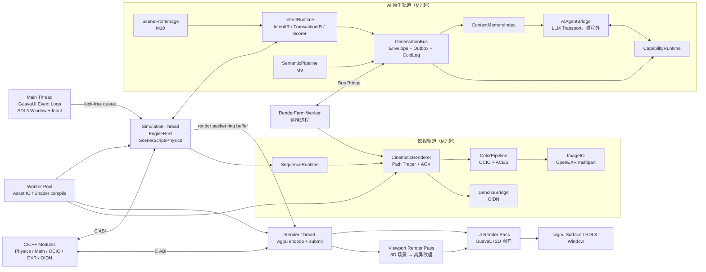

# Engine 蓝图（Swift + wgpu + C/C++）

## 0. 决策摘要

| 项目 | 选型 |
|------|------|
| 主语言 | Swift |
| 性能敏感模块 | C/C++，C ABI 接入 |
| 渲染抽象 | wgpu-native（跨平台，Metal / D3D12 / Vulkan） |
| 离线影视渲染 | 自研 Path Tracer（首版基于 wgpu compute + BVH on GPU） |
| 色彩管理 | OpenColorIO 2.x + ACES（CG / cct / display） |
| 图像 IO | OpenEXR（multipart + AOV，M8 起 deep EXR） |
| 降噪 | OIDN（CPU / Metal Performance Shaders 后端可选） |
| 窗口与输入 | SDL3 |
| 布局引擎 | 不在 Engine 层，归属 GuavaUI |
| AI 交互内核 | Engine 内 ObservationBus / CapabilityRuntime / IntentRuntime / ContextMemory；LLM 在进程外 |
| 跨进程协议 | Observation Bus Bridge（同机：共享内存 + 本地 socket；跨机：CBOR/Cap'n Proto，M11 选型） |
| 首发平台 | macOS，保留 Windows / Linux 扩展位 |

### 0.1 UI 方案历史

| 方案 | 状态 | 放弃原因 |
|------|------|----------|
| Zig + ImGui | 已实现 | C++ 绑定维护成本高 |
| Electron | 已实现 | 跨进程无法零拷贝，viewport 无法 240fps |
| 自定义 CEF | 已验证 | 同 Electron |
| Qt | 已验证 | 许可协议不可接受 |
| Avalonia | 已验证 | 生态薄弱，dock 问题无解 |
| SwiftUI / AppKit | 已验证 | 不跨平台，锁死 Apple 生态 |
| GuavaUI（自渲染）| **当前方案** | 与引擎共享 wgpu 实例，零拷贝，跨平台，完全可控 |

---

## 1. 架构总览



### 1.1 线程职责

| 线程 | 职责 |
|------|------|
| Main | SDL3 事件泵、GuavaUI hit-test、命令派发、Yoga 布局 |
| Simulation | 输入消费、物理、脚本、场景状态快照、SequenceRuntime 评估、TransactionExecutor 提交业务变更 |
| Render | 环形缓冲读取 RenderPacket，Viewport 3D pass → UI 2D pass → present |
| Cinematic Worker | 离线 Path Tracer 渐进 pass、AOV 写入、ColorPipeline 输出 |
| Denoise Worker | OIDN 异步降噪，结果回写 ImageStore 后发 Bus 事件 |
| Bus Relay | OutboxRelay 把业务事务的事件刷到 ObservationBus；ColdLog 落盘 |
| Memory Worker | ContextMemoryIndex 的 reducer、对账、GC |
| Agent IO | AIAgentBridge 与进程外 LLM 的 stdio / WebSocket 通信 |
| Farm Listener | 仅在 FarmWorker 进程：接收 Job、回报进度 |
| Worker Pool | 资源加载、Shader 编译、几何指纹计算、异步任务 |

> AI 与影视相关线程在 M7 之前不存在；M7 起按各 Phase 分批引入。

### 1.2 Swift / C 边界规则

1. 边界数据类型只用 POD 结构体。
2. 跨边界容器用指针 + 长度，不传 `std::vector`。
3. 谁分配谁释放，跨边界必须有对应 `free_*` 函数。
4. 错误用返回码，不抛 C++ 异常。

### 1.3 跨进程边界

进程间唯一信道是 `ObservationBus.BridgeNode`：

| 边界 | M7 之前 | M7 起 | M11 起 |
|---|---|---|---|
| Editor ↔ Engine | 同进程，函数调用 | 同进程；agent 也在同进程 | 同进程 |
| Engine ↔ AIAgent | — | 同进程 in-proc bridge | 同进程或本机跨进程（CLI 模式） |
| Editor ↔ FarmWorker | — | — | 跨进程 / 跨机 BridgeNode |

约束：

- 任何跨进程通信必须经 BridgeNode；不允许新增私有 IPC。
- 跨机不信任 monotonic 时钟；因果关系走 envelope 的 `causation_id` / `causal_seq`。

---

## 2. 目录结构

```
Engine/
├── Package.swift
├── Sources/
│   ├── EngineKernel/          # 核心协议与类型（无外部依赖）
│   │   ├── EngineKernel.swift      # EngineKernel 协议
│   │   ├── InputEvent.swift        # 输入事件类型
│   │   └── InGameUIProviding.swift # GuavaUI 反向注入协议
│   ├── RHIWGPU/               # wgpu RHI 绑定（底层 GPU API 封装）
│   ├── PlatformShell/         # SDL3 窗口与输入
│   ├── RenderBackend/         # 高层渲染管线抽象（实时）
│   ├── SceneRuntime/          # 场景图 / ECS（待实现）
│   ├── AssetPipeline/         # 资产加载（MeshAsset / OBJ 已实现）
│   ├── ScriptRuntime/         # 脚本 VM（待实现）
│   ├── EngineCore/            # EngineHost 编排
│   │
│   │  # —— M7 起新增（影视轨道） ——
│   ├── SequenceRuntime/       # SequenceDocument 评估、ShotEvaluator、ClipScheduler
│   ├── CinematicRenderer/     # Path Tracer、BSDF、AOV、Volume、Progressive
│   ├── ColorPipeline/         # OCIO + ACES、ViewTransform、LUT
│   ├── ImageIO/               # OpenEXR multipart、Cryptomatte、Deep EXR
│   ├── DenoiseBridge/         # OIDN / OptiX 适配
│   ├── RenderFarm/            # Orchestrator / Worker / JobScheduler（M11）
│   │
│   │  # —— M7 起新增（AI 原生轨道） ——
│   ├── ObservationBus/        # EventKindRegistry / Envelope / Publisher / Subscriber / Outbox / ColdLog / BridgeNode
│   ├── CapabilityRuntime/     # CapabilityRegistry / PreconditionChecker / ReleasePhaseGate
│   ├── IntentRuntime/         # IntentIR / TransactionIR / Executor / AmbiguityScorer
│   ├── ContextMemory/         # EntryKindRegistry / Reducers / Store / SnapshotProvider
│   ├── SemanticPipeline/      # StructureExtractor / GeometryFingerprinter / SemanticAnalyzer / SemanticMemoryStore
│   ├── SceneFromImage/        # ReferenceImageIntake / LayoutInference / SceneDraftBuilder / SceneMemoryStore（M10）
│   ├── AIAgentBridge/         # LLMTransport / SymbolicViewSerializer / ToolCallDispatcher（M10）
│   │
│   └── Bridge/
│       ├── CEngineBridge/     # 引擎 C ABI stubs
│       ├── CWGPUBridge/       # wgpu-native C 桥
│       ├── CSDL3/             # SDL3 系统库 shim
│       ├── CPhysicsBridge/    # Jolt（M4）
│       ├── CGLTFBridge/       # cgltf（M5）
│       ├── COCIOBridge/       # OpenColorIO（M7）
│       ├── COpenEXRBridge/    # OpenEXR + Imath（M7）
│       ├── COIDNBridge/       # Intel Open Image Denoise（M8）
│       └── CFingerprintBridge/# 几何指纹 SIMD 加速（M9）
├── vendor/wgpu/               # wgpu-native 预编译库（不提交 .dylib）
├── vendor/ocio/               # OpenColorIO 预编译 + ACES studio config 子集
├── vendor/openexr/            # OpenEXR + Imath 预编译
├── vendor/oidn/               # OIDN 预编译
└── scripts/
    ├── fetch-wgpu.sh
    ├── fetch-ocio.sh          # M7 起
    ├── fetch-openexr.sh
    └── fetch-oidn.sh
```

---

## 3. C ABI 集成规范

### 3.1 头文件约定

```c
// Engine/Sources/Bridge/CEngineBridge/include/engine_bridge.h
#ifndef ENGINE_BRIDGE_H
#define ENGINE_BRIDGE_H
#include <stdint.h>

#ifdef __cplusplus
extern "C" {
#endif

void engine_init(void);
void engine_tick_input(double delta_time);
void engine_tick_sim(double delta_time);
void engine_tick_render_prepare(double delta_time);
void engine_tick_render_submit(double delta_time);
void engine_shutdown(void);

#ifdef __cplusplus
}
#endif
#endif
```

### 3.2 句柄生命周期

```swift
// Swift 侧持有 C 堆对象的标准模式
final class NativeHandle {
    private var ptr: UnsafeMutableRawPointer?

    init() { ptr = engine_create_context() }

    deinit {
        if let p = ptr { engine_destroy_context(p) }
    }
}
```

### 3.3 跨边界数组

```swift
func submitBodies(_ bodies: inout [RigidBody]) {
    bodies.withUnsafeMutableBufferPointer { buf in
        physics_step(buf.baseAddress, UInt32(buf.count), deltaTime)
    }
}
```

---

## 4. wgpu 集成

wgpu-native C API 是首选路径（稳定、跨平台、可与 SwiftPM C target 直接集成）。

初始化链路：`wgpuCreateInstance` → `wgpuInstanceRequestAdapter` → `wgpuAdapterRequestDevice` → `wgpuDeviceCreateSwapChain`（SDL3 surface）。

参考：`Engine/Sources/RHIWGPU/RHIWGPU.swift`，`Engine/Sources/Bridge/CWGPUBridge/`。

获取 wgpu-native：

```bash
cd Engine && bash scripts/fetch-wgpu.sh
```

---

## 5. 当前状态

| 模块 | 状态 | 说明 |
|------|------|------|
| EngineKernel | ✅ 完成 | 协议、InputEvent、InGameUIProviding |
| RHIWGPU | ✅ 完成 | Buffer、Texture、Pipeline、BindGroup、CommandEncoder 等 |
| PlatformShell | ✅ 完成 | SDL3 窗口创建、事件泵、多平台 surface |
| RenderBackend | ✅ 完成 | 真实 wgpu 渲染路径、RenderPacket 消费、viewport surface 零拷贝状态导出已接通 |
| AssetPipeline | ⚠️ 部分 | MeshAsset、BuiltinMesh、OBJLoader 已实现，GLTF/纹理缺失 |
| SceneRuntime | ⚠️ 占位 | 仅 revision 计数，缺 ECS |
| ScriptRuntime | ⚠️ 占位 | 仅空 tick，缺 VM |
| EngineCore | ✅ 完成 | EngineHost / SimulationThread / RenderThread / RingBuffer 三线程协作已接通 |
| CEngineBridge | ⚠️ Staged Stub | 仍是示意实现，但已支持 Phase 2 的流水化阶段计数 |
| CWGPUBridge | ✅ 完成 | wgpu-native 头文件桥接 |
| CSDL3 | ✅ 完成 | SDL3 pkg-config 系统库 |
| SequenceRuntime | ⛔ 未启动 | M7 引入，详细见 `ai-native-sequence-document-design.md` |
| CinematicRenderer | ⛔ 未启动 | M7（地基）+ M8（深度），详细见 Phase 7 / 10 |
| ColorPipeline | ⛔ 未启动 | M7 引入 OCIO + ACES |
| ImageIO | ⛔ 未启动 | M7 引入 OpenEXR multipart |
| DenoiseBridge | ⛔ 未启动 | M8 引入 OIDN |
| ObservationBus | ⛔ 未启动 | M7 引入，详细见 `ai-native-observation-bus-design.md` |
| CapabilityRuntime | ⛔ 未启动 | M7 引入，schema 见 `ai-native-capability-graph-schema-design.md` |
| IntentRuntime | ⛔ 未启动 | M7 引入；首版只支持人工构造 IntentIR |
| ContextMemory | ⛔ 未启动 | M9 引入，详细见 `ai-native-context-memory-index-design.md` |
| SemanticPipeline | ⛔ 未启动 | M9 引入，详细见 `ai-native-semantic-pipeline-design.md` |
| SceneFromImage | ⛔ 未启动 | M10 引入，详细见 `ai-native-scene-from-image-design.md` |
| AIAgentBridge | ⛔ 未启动 | M10 引入；与具体 LLM API 解耦 |
| RenderFarm | ⛔ 未启动 | M11 引入，复用 ObservationBus 跨机 BridgeNode |
| C 桥（OCIO / OpenEXR / OIDN / Fingerprint） | ⛔ 未启动 | 与对应 Phase 同期引入 |

---

## 6. 路线图

### Phase 0 — 骨架建立 ✅ 已完成

**目标**：三包结构建立，wgpu 链路打通，单网格离屏渲染可运行。

已完成内容：
- SwiftPM 三包（Engine / GuavaUI / Editor）
- RHIWGPU 完整绑定
- PlatformShell SDL3 窗口 + 多平台 surface
- AssetPipeline MeshAsset / OBJLoader
- EngineHost 编排骨架

**验收命令**：
```bash
cd Engine && swift build        # 必须 0 error
```

---

### Phase 1 — 真实 wgpu 3D 场景渲染 ✅ 已完成

**目标**：`RenderBackend` 实现真实 wgpu 渲染路径，替换 Metal 占位，能渲染带光照的 3D 场景到离屏纹理。

| 任务 | 产出文件 |
|------|---------|
| 实现 `WGPURenderer`（使用 RHIWGPU） | `Engine/Sources/RenderBackend/RenderBackend.swift` |
| 实现 wgpu Surface present 完整链路 | `Engine/Sources/RenderBackend/RenderBackend.swift` |
| 实现 Lambert 光照 shader、MVP uniform、深度缓冲 | `Engine/Sources/RenderBackend/RenderBackend.swift` |
| OBJ / builtin cube 网格上传 GPU Buffer | `Engine/Sources/RenderBackend/RenderBackend.swift` |
| viewport surface 状态导出 | `Engine/Sources/RenderBackend/ViewportSurface.swift` |

**验收标准**：
1. `swift run EditorApp` 打开 SDL3 窗口，窗口内可见带光照的 OBJ 网格（如 `FinalBaseMesh.obj`）。
2. `xctrace record --template "Metal System Trace"` 无 CPU readback 路径。
3. FPS ≥ 60（macOS M 系芯片）。

---

### Phase 2 — 多线程渲染循环 ✅ 已完成

**目标**：Main / Simulation / Render 三线程分离，Render 从三缓冲环形缓冲消费最新 `RenderPacket`，Main 不等待 GPU。

| 任务 | 产出文件 |
|------|---------|
| `RenderPacket` 结构体（场景快照） | `Engine/Sources/RenderBackend/RenderPacket.swift` |
| 三缓冲环形缓冲（latest-wins） | `Engine/Sources/EngineCore/RingBuffer.swift` |
| Simulation DispatchQueue 独立线程 | `Engine/Sources/EngineCore/SimulationThread.swift` |
| Render DispatchQueue 独立线程 | `Engine/Sources/EngineCore/RenderThread.swift` |
| EngineHost 重构为三线程协作 | `Engine/Sources/EngineCore/EngineCore.swift` |
| 线程安全状态包装 | `Engine/Sources/EngineCore/LockedState.swift` |
| C ABI 阶段状态改为流水化计数 | `Engine/Sources/Bridge/CEngineBridge/engine_bridge.c` |

**验收标准**：
1. `swift test --filter RenderThreadTests` 通过。
2. Instruments Timeline 三线程可见，Main 线程无 GPU 等待。
3. Sim → Render 延迟 ≤ 2ms（P99，macOS M 芯片）。

---

### Phase 3 — 物理与场景 ECS

**目标**：SceneRuntime 实现 ECS，CEngineBridge 接入真实物理（Jolt Physics via C ABI）。

| 任务 | 产出文件 |
|------|---------|
| ECS Entity / Component 存储 | `Engine/Sources/SceneRuntime/ECS.swift` |
| Transform / MeshRenderer / Light 组件 | `Engine/Sources/SceneRuntime/Components.swift` |
| SceneGraph 节点树 | `Engine/Sources/SceneRuntime/SceneGraph.swift` |
| Jolt Physics C 头文件封装 | `Engine/Sources/Bridge/CPhysicsBridge/include/physics_bridge.h` |
| Jolt Physics C++ 实现 | `Engine/Sources/Bridge/CPhysicsBridge/physics_bridge.cpp` |
| Swift 侧 PhysicsBridge | `Engine/Sources/EngineCore/PhysicsBridge.swift` |
| RigidBody / Collider 组件 | `Engine/Sources/SceneRuntime/PhysicsComponents.swift` |

**验收标准**：
1. `swift test --filter SceneRuntimeTests` 通过（Entity CRUD、组件读写）。
2. `swift test --filter PhysicsBridgeTests` 通过（重力自由落体，位置数值正确）。

---

### Phase 4 — 脚本运行时

**目标**：ScriptRuntime 能加载和执行 Swift 闭包脚本（首版），预留 Lua / Wren VM 接入位。

| 任务 | 产出文件 |
|------|---------|
| ScriptContext（闭包注册表） | `Engine/Sources/ScriptRuntime/ScriptContext.swift` |
| ScriptComponent（挂载到 ECS） | `Engine/Sources/ScriptRuntime/ScriptComponent.swift` |
| Script 生命周期（onStart / onTick / onDestroy） | `Engine/Sources/ScriptRuntime/ScriptLifecycle.swift` |
| 脚本注册 API | `Engine/Sources/ScriptRuntime/ScriptRuntime.swift` |

**验收标准**：
1. 能在场景中注册 Swift 闭包脚本，每帧 `onTick` 被调用。
2. `swift test --filter ScriptRuntimeTests` 通过。

---

### Phase 5 — 资产管线补全

**目标**：GLTF 2.0 导入、纹理加载（PNG / KTX2）、材质系统。

| 任务 | 产出文件 |
|------|---------|
| GLTF 2.0 解析（cgltf C 库，C ABI 接入） | `Engine/Sources/Bridge/CGLTFBridge/` |
| GLTF → MeshAsset 转换 | `Engine/Sources/AssetPipeline/GLTFImporter.swift` |
| 纹理解码（PNG via stb_image C ABI） | `Engine/Sources/AssetPipeline/TextureImporter.swift` |
| 材质定义（PBR 参数） | `Engine/Sources/AssetPipeline/MaterialAsset.swift` |
| 资产注册表（UUID → 资产路径） | `Engine/Sources/AssetPipeline/AssetRegistry.swift` |
| 异步加载队列（Worker Pool） | `Engine/Sources/AssetPipeline/AssetLoader.swift` |

**验收标准**：
1. 能加载 Khronos 官方 GLTF 测试模型（Box.gltf）并渲染。
2. 纹理正确映射到网格。
3. `swift test --filter AssetPipelineTests` 通过。

---

### Phase 6 — 跨平台移植

**目标**：Windows（D3D12/Vulkan）和 Linux（Vulkan）可编译运行。

| 任务 | 产出文件 |
|------|---------|
| Windows SDL3 surface（HWND） | `Engine/Sources/PlatformShell/Win32Shell.swift` |
| Linux SDL3 surface（Wayland / X11） | `Engine/Sources/PlatformShell/LinuxShell.swift` |
| Package.swift 条件编译 | `Engine/Package.swift` |
| CI 矩阵（GitHub Actions） | `.github/workflows/engine.yml` |

**验收标准**：
1. Windows 和 Linux 各自 `swift build` 零错误。
2. `swift run EditorApp` 在三平台渲染同一场景。

---

### Phase 7 — 影视渲染地基（M7 影视轨道）

**目标**：Engine 内出现可独立运行的离线渲染最小可用版与剪辑评估器；色彩管理与 EXR 输出走通 ACEScg 基线。

| 任务 | 产出文件 |
|------|---------|
| SequenceDocument 数据模型 | `Engine/Sources/SequenceRuntime/SequenceDocument.swift` |
| ShotEvaluator 五步合成规则 | `Engine/Sources/SequenceRuntime/ShotEvaluator.swift` |
| ClipScheduler（i64 frame 内部时间） | `Engine/Sources/SequenceRuntime/ClipScheduler.swift` |
| Path Tracer 单 bounce 渐进版 | `Engine/Sources/CinematicRenderer/PathTracer.swift` |
| 采样策略（halton / blue noise） | `Engine/Sources/CinematicRenderer/SamplingStrategy.swift` |
| AOV 注册（diffuse / specular / depth / normal / cryptomatte 占位） | `Engine/Sources/CinematicRenderer/AOVRegistry.swift` |
| OCIO C ABI 封装 | `Engine/Sources/Bridge/COCIOBridge/include/ocio_bridge.h` 等 |
| OCIO Swift 适配 | `Engine/Sources/ColorPipeline/OCIOBridge.swift` |
| ACES 配置（CG / cct / display 三组） | `Engine/Sources/ColorPipeline/ACESConfig.swift` |
| ViewTransform | `Engine/Sources/ColorPipeline/ViewTransform.swift` |
| OpenEXR C ABI 封装 | `Engine/Sources/Bridge/COpenEXRBridge/` |
| EXR multipart writer / reader | `Engine/Sources/ImageIO/EXRWriter.swift` 等 |

**约束**：

- 所有渲染输出在写入 EXR 前必须经 ColorPipeline；硬编码 sRGB 路径在 CI 校验中被拒绝。
- SequenceRuntime 仅消费 `SequenceDocument`，不直接读 SceneRuntime 业务字段；改写一律走 IntentRuntime（Phase 8 后启用）。
- Path Tracer 首版在 wgpu compute shader 上实现 BVH 遍历；CUDA / Metal RT 不进 RHI 抽象，留作后端可选项。

**验收标准**：

1. 单镜头 1024×1024 64spp + Lambert + 单光源能在 30 秒内产出，输出 multipart EXR 包含 `beauty / depth / normal` 三层。
2. 同一帧经 ACES sRGB 视图变换的预览与 DJV 打开的 EXR 完全一致（diff < 1 LSB）。
3. `swift test --filter SequenceRuntimeTests CinematicRendererTests ColorPipelineTests ImageIOTests` 全部通过。

---

### Phase 8 — AI 原生交互层骨架（M7 AI 轨道）

**目标**：Engine 与 Editor 之间出现完整的"意图 → 校验 → 确认 → 事务 → 事件"闭路，但 LLM 接入不在本期；首版只支持人工构造 IntentIR。

| 任务 | 产出文件 |
|------|---------|
| EventKindRegistry（闭集） | `Engine/Sources/ObservationBus/EventKindRegistry.swift` |
| EventEnvelope / PayloadRef | `Engine/Sources/ObservationBus/EventEnvelope.swift` |
| Publisher / Subscriber / FilterAst | `Engine/Sources/ObservationBus/{Publisher,Subscriber}.swift` |
| Outbox + Relay（与业务事务原子） | `Engine/Sources/ObservationBus/OutboxRelay.swift` |
| ColdLog（per stream append-only） | `Engine/Sources/ObservationBus/ColdLog.swift` |
| CapabilityRegistry（schema 加载与校验） | `Engine/Sources/CapabilityRuntime/CapabilityRegistry.swift` |
| PreconditionChecker（PredicateAst 求值） | `Engine/Sources/CapabilityRuntime/PreconditionChecker.swift` |
| ReleasePhaseGate | `Engine/Sources/CapabilityRuntime/ReleasePhaseGate.swift` |
| IntentIR / TransactionIR 数据结构 | `Engine/Sources/IntentRuntime/{IntentIR,TransactionIR}.swift` |
| TransactionExecutor（写 SceneRuntime + 进 Outbox） | `Engine/Sources/IntentRuntime/TransactionExecutor.swift` |
| AmbiguityScorer + Question 生成 | `Engine/Sources/IntentRuntime/AmbiguityScorer.swift` |

Editor 侧（详细见 editor-blueprint）：

| 任务 | 产出文件 |
|------|---------|
| MinimalConfirmationUI 宿主面板 | `Editor/Sources/EditorApp/ai/ConfirmationHostPanel.swift` |
| 人工 IntentIR 输入面板 | `Editor/Sources/EditorApp/ai/IntentInputPanel.swift` |

**约束**：

- 任何 SceneRuntime / SequenceRuntime / AssetPipeline 的写操作只允许经 TransactionExecutor，CI 阶段静态检查（grep + 编译期访问控制）。
- `transaction.applied` 与对应业务写入必须在崩溃—恢复后保持原子（Outbox + 幂等 event_id）。
- ObservationBus 在 Phase 8 仅做进程内（同进程订阅 + ColdLog），跨进程留到 Phase 11。

**验收标准**：

1. Editor 内可手工构造 `transform.set` 等三个最小 capability 并经完整路径执行；执行后 ColdLog 能回放出 `transaction.staged → applied` 序列。
2. `swift test --filter ObservationBusTests CapabilityRuntimeTests IntentRuntimeTests` 全部通过。
3. 静态检查在 CI 拒绝任何绕过 TransactionExecutor 的写路径示例。

---

### Phase 9 — Semantic Pipeline + Context Memory（M9 AI 轨道）

**目标**：B.5 流水线（详细见 `ai-native-semantic-pipeline-design.md`）在 Engine 内实现 in-proc 版；ContextMemoryIndex 完成 6 个 EntryKind 的 reducer 与 SymbolicView 输出。

| 任务 | 产出文件 |
|------|---------|
| StructureExtractor / GeometryAnalyzer | `Engine/Sources/SemanticPipeline/{StructureExtractor,GeometryAnalyzer}.swift` |
| CandidateRegionBuilder | `Engine/Sources/SemanticPipeline/CandidateRegionBuilder.swift` |
| GeometryFingerprinter（SHA + spectral） | `Engine/Sources/SemanticPipeline/GeometryFingerprinter.swift` |
| C 桥（SIMD spectral hash） | `Engine/Sources/Bridge/CFingerprintBridge/` |
| SemanticAnalyzer + 多 backend 抽象 | `Engine/Sources/SemanticPipeline/SemanticAnalyzer.swift` |
| HeuristicBackend（无 LLM 基线） | `Engine/Sources/SemanticPipeline/backends/HeuristicBackend.swift` |
| VisionBackend（接口预留） | `Engine/Sources/SemanticPipeline/backends/VisionBackend.swift` |
| SemanticMemoryStore（KNN，向量永不出库） | `Engine/Sources/SemanticPipeline/SemanticMemoryStore.swift` |
| ContextMemory：EntryKindRegistry + Reducers | `Engine/Sources/ContextMemory/{EntryKindRegistry,Reducers}.swift` |
| ContextMemory：Store + SnapshotProvider | `Engine/Sources/ContextMemory/{MemoryStore,SnapshotProvider}.swift` |
| 首批 capability 注册（场景 / 资产 / 序列 / 影视 / 诊断） | `Engine/Sources/CapabilityRuntime/registry/` |

**约束**：

- 任何向量 / spectral hash / embedding 不允许进入 ContextMemory.payload；只作为 SemanticMemoryStore 的检索输入与 handle。
- ContextMemory.reducer 必须是纯函数；CI 用 fuzz 事件流验证"重放 bit-equal"。
- VisionBackend 仅作为接口存在，本 Phase 不接入实际视觉模型。

**验收标准**：

1. 同一 .obj 重导入后 SemanticMemoryStore 命中率 > 90%（基于几何指纹）。
2. fuzz 测试 10 万条事件下，reducer 重放 entry 集 bit-equal。
3. MemorySymbolicView 在 prompt budget 限制下不出现自然语言原文 / 向量 / 图像 bytes。

---

### Phase 10 — 影视渲染深度（M8）

**目标**：CinematicRenderer 进入生产可用门槛——多 bounce 路径追踪、principled BSDF、降噪、Cryptomatte、deep EXR、Lookdev 工作台所需的接口齐备。

| 任务 | 产出文件 |
|------|---------|
| BSDFRegistry（principled / glass / hair / sss） | `Engine/Sources/CinematicRenderer/BSDFRegistry.swift` |
| LightTransport（MIS / NEE / 可选 ReSTIR） | `Engine/Sources/CinematicRenderer/LightTransport.swift` |
| VolumeIntegrator | `Engine/Sources/CinematicRenderer/VolumeIntegrator.swift` |
| ProgressivePass（断点续渲） | `Engine/Sources/CinematicRenderer/ProgressivePass.swift` |
| OIDN C 桥 | `Engine/Sources/Bridge/COIDNBridge/` |
| OIDNDenoiser Swift 适配 | `Engine/Sources/DenoiseBridge/OIDNDenoiser.swift` |
| OptiXDenoiser（CUDA 平台可选） | `Engine/Sources/DenoiseBridge/OptiXDenoiser.swift` |
| DisplayTransform / LUTLibrary / LookConfig | `Engine/Sources/ColorPipeline/{DisplayTransform,LUTLibrary,LookConfig}.swift` |
| DeepEXR writer + Cryptomatte encoder | `Engine/Sources/ImageIO/{DeepEXRWriter,CryptomatteEncoder}.swift` |

**验收标准**：

1. 单帧 1080p 256spp + 单 GPU 在 5 分钟内产出，OIDN 去噪后噪点与 Cycles GPU 同档。
2. Cryptomatte 在 Nuke 中可正确取 ID。
3. `swift test --filter CinematicRendererTests DenoiseBridgeTests` 全部通过。

---

### Phase 10.5 — Scene-from-Image + AIAgentBridge（M10）

**目标**：参考图 → SceneDocument 草稿 → 用户确认 → 写入流水线打通；进程外 LLM 经 AIAgentBridge 调用 CapabilityGraph。

| 任务 | 产出文件 |
|------|---------|
| ReferenceImageIntake | `Engine/Sources/SceneFromImage/ReferenceImageIntake.swift` |
| LayoutInference | `Engine/Sources/SceneFromImage/LayoutInference.swift` |
| AssetMatcher（pHash + CLIP handle） | `Engine/Sources/SceneFromImage/AssetMatcher.swift` |
| SceneDraftBuilder（输出 SceneDocument，标 inferred） | `Engine/Sources/SceneFromImage/SceneDraftBuilder.swift` |
| SceneMemoryStore | `Engine/Sources/SceneFromImage/SceneMemoryStore.swift` |
| LLMTransport（stdio + WebSocket） | `Engine/Sources/AIAgentBridge/LLMTransport.swift` |
| PromptBudget | `Engine/Sources/AIAgentBridge/PromptBudget.swift` |
| SymbolicViewSerializer（复用 Bus / Memory 视图） | `Engine/Sources/AIAgentBridge/SymbolicViewSerializer.swift` |
| ToolCallDispatcher（LLM tool_call → IntentIR） | `Engine/Sources/AIAgentBridge/ToolCallDispatcher.swift` |

**约束**：

- 参考图与 CLIP 向量不进 LLM prompt；只通过结构化布局描述与 handle 暴露。
- LLM 的所有写操作必须经 ToolCallDispatcher → IntentIR → TransactionExecutor，禁止旁路。
- AIAgentBridge 与具体 LLM API 解耦；切换模型不影响其他模块。

**验收标准**：

1. 拖入参考图 → SceneDraft 给出可编辑结果 → 经 MinimalConfirmationUI 确认后写入 SceneDocument。
2. 至少一个商业 LLM 能通过 tool_call 调用首批所有 capability；越过 ReleasePhaseGate 的调用被拒绝并回写结构化错误。
3. `swift test --filter SceneFromImageTests AIAgentBridgeTests` 全部通过。

---

### Phase 11 — Render Farm + ObservationBus 跨机 Bridge（M11）

**目标**：影视渲染走分布式；agent 长会话上下文经 ContextMemory 对账保留；ObservationBus 跨进程 / 跨机生效。

| 任务 | 产出文件 |
|------|---------|
| FarmOrchestrator | `Engine/Sources/RenderFarm/FarmOrchestrator.swift` |
| FarmWorker（独立进程 target） | `Engine/Sources/RenderFarm/FarmWorker.swift` |
| JobScheduler（按 shot / range / aov 切分） | `Engine/Sources/RenderFarm/JobScheduler.swift` |
| ResultCollector（EXR handle → ImageStore） | `Engine/Sources/RenderFarm/ResultCollector.swift` |
| ProgressBridge（走 runtime.metric.sampled） | `Engine/Sources/RenderFarm/ProgressBridge.swift` |
| ObservationBus.BridgeNode | `Engine/Sources/ObservationBus/BridgeNode.swift` |
| BridgePolicy（cross_process_allowed 校验） | `Engine/Sources/ObservationBus/BridgePolicy.swift` |
| ResyncProtocol（snapshot + cursor） | `Engine/Sources/ObservationBus/ResyncProtocol.swift` |
| ContextMemory 对账与 GC 强化 | `Engine/Sources/ContextMemory/Reconciliation.swift` |

**约束**：

- 跨机协议在本 Phase 之初做选型决议（CBOR vs Cap'n Proto），决议后写入 `vendor/` 并固定版本。
- 跨进程不允许新增私有 IPC；FarmWorker 与 Editor 之间的所有通信经 BridgeNode。
- 跨机时钟仅作展示，因果走 envelope 的 `causation_id` / `causal_seq`。

**验收标准**：

1. 在两台机器上启动 FarmWorker，编辑器能自动发现并提交 100 帧 sequence；结果回流后可直接进 DailiesPanel。
2. Bridge 断连—重连后订阅者状态完整恢复，无重复消费。
3. 关闭编辑器再重启 agent，ContextMemory 对账完成后仍能列出昨天未 resolve 的 confirmation 与 last_diffs。

---

## 7. 风险

| 风险 | 缓解策略 |
|------|----------|
| Swift / C++ 生命周期错配 | 句柄封装类 + `deinit` 明确销毁，禁止裸指针跨边界持久持有 |
| wgpu-native API 演进 | 固定版本（`vendor/wgpu/wgpu-native-meta/wgpu-native-git-tag`），更新前先跑回归 |
| 渲染线程争用 | 环形缓冲只做索引级别 lock，数据双缓冲，不在渲染路径持锁 |
| 240fps 下 CPU 过高 | 固定步长（4ms Sim），Render 线程 waitForNextFrame 对齐 VSync |
| C++ 编译复杂度 | 物理模块只暴露 C ABI，C++ 编译单元隔离在 Bridge target |
| OpenColorIO 跨平台编译 + ACES config 体积 | 仅集成 OCIO 2.x C ABI，自带 ACES studio config 子集；完整 LUT 库异步下载 |
| OpenEXR / Imath 依赖链复杂 | 用 vcpkg / SwiftPM C target 静态链接；deep EXR 留到 Phase 10 |
| Path Tracer 在 wgpu 上无原生 RT | 首版走 BVH on compute shader；CUDA / Metal RT 加速作为后端选项，不进 RHI 抽象 |
| OIDN 仅 CPU 加速链 | 单帧降噪走 CPU 异步线程不阻塞 RT；批量去噪在 RenderFarm worker 上执行 |
| LLM 协议变化频繁 | LLMTransport 与 ToolCallDispatcher 隔离；面向 CapabilityGraph 而非具体 LLM API |
| ObservationBus 跨机协议未定 | Phase 11 之初做选型决议（CBOR vs Cap'n Proto），决议后版本锁定 |
| ContextMemory 对账成本随事件量增长 | 强制 ColdLog retention 上限；超出窗口的 entry 直接丢弃重新冷启 |
| Capability 实现与 schema 文档脱节 | CI 强制：CapabilityGraph schema 校验 + side_band_emits 与 EventKindRegistry 双向校验 |
| 跨进程业务旁路 | TransactionExecutor 是唯一写路径；CI 用静态分析 + 运行期断言双重防护 |
| inferred 语义被误用为 authored | 所有 inferred 升格只能经 `asset.promote_inferred_to_authored`；其他 capability 写 authored 字段时若上游 provenance = inferred 直接拒绝 |
