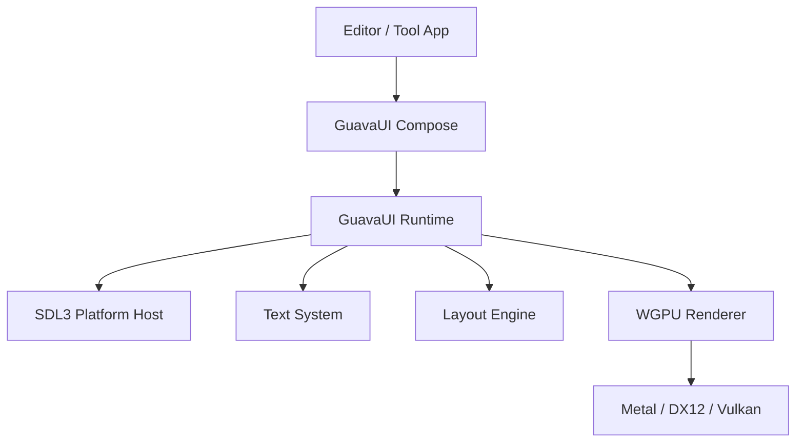

# GuavaUI 架构蓝图（Runtime + Compose）

## 0. 定位

GuavaUI 从一开始就按独立 UI 库设计，不按“先做编辑器，后面再抽库”的路线走。

GuavaUI 的目标不是复刻 SwiftUI，而是做一个：

- 用 Swift 编写
- 跨平台
- 自渲染
- 面向桌面工具和编辑器
- API 风格接近 SwiftUI / Compose
- 运行时完全可控

GuavaUI 的产品形态分成两层：

1. Runtime
- 平台、输入、布局、文字、渲染、节点树、recompose 运行时。

2. Compose
- 声明式 API、状态系统、modifier、layout composable、组件集合。

组件属于 Compose 层，不属于 Runtime 层。

## 1. 设计原则

### 1.1 必须满足

- 与引擎共享 wgpu 设备和纹理。
- 支持 viewport 零拷贝嵌入。
- 支持 desktop-first 交互：鼠标、键盘、焦点、快捷键、拖拽、Dock。
- 支持 retained-mode 运行时。
- 支持声明式 UI 写法。
- 支持跨平台窗口与输入。
- 支持复杂工具类组件：Tree、PropertyGrid、Dock、ContextMenu、ViewportHost。

### 1.2 明确不追求

- 不追求 SwiftUI 兼容。
- 不追求首版覆盖移动端控件生态。
- 不追求首版做完整动画系统。
- 不追求首版做无障碍系统。
- 不追求首版做完整导航和应用生命周期框架。

## 2. 技术选型

| 项目 | 选型 | 理由 |
|------|------|------|
| 主语言 | Swift | 与引擎一致，适合做 DSL 和框架边界 |
| GPU 后端 | wgpu-native | 跨平台，支持 Metal / D3D12 / Vulkan |
| 窗口层 | SDL3 | 跨平台窗口、事件泵、原生句柄抽取 |
| 布局引擎 | Yoga（首版） | 先用成熟 flex layout，后续可替换局部布局器 |
| 文字 shaping | HarfBuzz | 跨平台一致文本 shaping |
| 字形光栅化 | FreeType | 跨平台稳定，便于做字形图集 |
| UI 范式 | Retained mode + recompose | 更适合编辑器场景和脏区更新 |
| 风格参考 | SwiftUI API + Compose 分层 | API 友好，运行时边界更清楚 |

## 3. 总体分层



依赖方向只有一条：

- Runtime 不依赖 Compose。
- Compose 依赖 Runtime。
- 应用依赖 Compose。

## 4. 模块边界

建议按 SwiftPM target 划分：

```
Sources/
├── GuavaUIRuntime/
│   ├── Platform/
│   ├── Input/
│   ├── Tree/
│   ├── State/
│   ├── Layout/
│   ├── Text/
│   ├── Render/
│   ├── Resources/
│   └── Diagnostics/
├── GuavaUICompose/
│   ├── Compose/
│   ├── Modifier/
│   ├── Environment/
│   ├── Foundation/
│   ├── Desktop/
│   └── Viewport/
└── App 层
    └── Editor widgets / domain logic
```

### 4.1 Runtime 负责什么

- 平台宿主
- 事件接入
- 焦点与命中测试
- 节点树
- 状态失效传播
- recomposer
- layout 计算
- draw list 生成
- 文本 shaping 与 atlas
- GPU 提交

### 4.2 Compose 负责什么

- 声明式 API
- 状态读写接口
- modifier 链
- 环境注入
- 通用 layout composable
- 通用组件
- 桌面工具组件

### 4.3 应用层负责什么

- SceneHierarchy 的业务绑定
- Inspector 的领域模型
- MaterialEditor
- AssetBrowser
- AnimationEditor
- Gizmo overlay 的编辑器语义

## 5. Runtime 核心契约

Runtime 需要先定清楚六个协议。

### 5.1 Node Tree

每个 compose 节点最终都会落成 RuntimeNode。

RuntimeNode 至少包含：

- identity
- parent / children
- layout style
- computed frame
- visual style
- focusable / hit-testable 标记
- dirty flags
- 关联的渲染资源句柄

dirty flag 至少分成四类：

- structure dirty
- layout dirty
- paint dirty
- state dirty

### 5.2 Recomposer

Recomposer 负责把 Compose 描述刷新成 RuntimeNode 树。

职责：

- 跟踪状态读取
- 在状态变化时定位受影响子树
- 重组受影响的 compose subtree
- 输出节点更新计划
- 驱动 layout / paint invalidation

Recomposer 的单位不是“全树重建”，而是“子树重组”。

### 5.3 State / Binding

首版只做最小集：

- State<Value>
- Binding<Value>
- ObservableObject 或等价机制
- Environment 值读取

原则：

- 状态更新只触发订阅该状态的子树。
- Binding 只是一层读写映射，不带业务逻辑。
- 业务状态留在应用层 store，Compose 只消费。

### 5.4 Modifier

Modifier 不直接生成节点，它只描述节点属性变换。

Modifier 至少分三类：

- layout modifier
- render modifier
- interaction modifier

例如：

- padding、frame、flexGrow 属于 layout modifier。
- background、border、shadow 属于 render modifier。
- hover、focusable、onTap、onKeyDown 属于 interaction modifier。

### 5.5 Layout

首版 layout 不追求纯自研，先以 Yoga 为主。

策略：

- 通用 stack / flow / overlay 布局走 Yoga。
- SplitPane、DockContainer 允许自定义布局器。
- ViewportHost 允许固定约束布局。

Layout 系统必须支持：

- dirty subtree recompute
- intrinsic size
- min / max constraints
- scrollable content measurement
- panel docking 后的树结构重算

### 5.6 Event System

事件流采用三阶段：

```text
SDL3 Event
-> Platform Event
-> Runtime InputEvent
-> HitTest
-> Capture
-> Target
-> Bubble
```

必须内建：

- pointer event
- keyboard event
- wheel event
- drag state
- focus chain
- shortcut dispatch
- pointer capture

ViewportHost 有特殊输入路由：

- 命中后可把事件直接转发给引擎。
- 是否冒泡由 ViewportHost 策略决定。

## 6. 渲染模型

Runtime 的渲染分三层：

1. 节点树
- 表达 UI 结构。

2. DrawList
- 把节点树压平成绘制命令。

3. Renderer
- 把 DrawList 编码成 wgpu 命令。

### 6.1 图元范围

首版只做工具 UI 所需图元：

- fill rect
- rounded rect
- border
- shadow
- image quad
- glyph quad
- viewport texture quad

### 6.2 批处理原则

- 按 shader / texture / scissor 合批。
- 节点顺序决定默认绘制顺序。
- overlay 层允许独立 pass。
- viewport 纹理作为普通 image source 处理。

### 6.3 文字系统

文本链路：

- string
- shaping
- glyph run
- atlas upload
- draw commands

必须支持：

- 多字体
- 多字号
- emoji / unicode 基本可用
- IME 预编辑区预留接口

## 7. Compose API 目标

GuavaUI Compose 的目标是：

- API 读起来接近 SwiftUI
- 架构上更接近 Compose

首版不做语言魔法优先，先做可维护的 API。

### 7.1 首版抽象

- View / Composable 协议
- ComposeBuilder
- Modifier
- State / Binding
- Environment
- Layout composable

### 7.2 参考 API 形态

```swift
WindowRoot {
    DockContainer {
        Panel("Hierarchy") {
            Tree(data: sceneTree)
        }

        Panel("Viewport") {
            ViewportHost(surface: viewportSurface)
        }

        Panel("Inspector") {
            PropertyGrid(model: inspectorModel)
        }
    }
}
```

这里的重点不是完全复制 SwiftUI，而是让：

- UI 用声明式写法表达。
- Runtime 仍然由我们自己掌控。

## 8. 组件分层

Compose 层内部再分两个带宽。

### 8.1 Foundation Components

这些是通用能力：

- Box
- Row
- Column
- Overlay
- Spacer
- ScrollView
- Text
- TextField
- Button
- Image
- List
- Tree
- Tabs
- Split

### 8.2 Desktop / Tooling Components

这些仍然属于通用库，但偏桌面工具场景：

- DockContainer
- DockTabs
- Panel
- Toolbar
- ContextMenu
- CommandPalette
- PropertyGrid
- ViewportHost
- StatusBar

### 8.3 不进 GuavaUI 的组件

这些先留在应用层：

- SceneHierarchy 的引擎绑定
- Inspector 的具体字段面板
- Material Graph 的业务节点
- Animation timeline 的领域逻辑
- Asset 管理器的资源协议

判断标准：

- 脱离 Guava 编辑器语境仍然成立的能力，进 GuavaUI。
- 一离开 scene / asset / material / gizmo 语境就失去意义的能力，留在应用层。

## 9. 平台集成

### 9.1 平台职责

平台层只负责：

- 创建窗口
- 事件泵
- 获取原生窗口句柄
- 剪贴板
- 光标
- 文件对话框
- IME / 文本输入桥接

### 9.2 目标平台

| 平台 | 窗口 | surface | 后端优先级 |
|------|------|---------|------------|
| macOS | SDL3 | Metal layer | Metal -> automatic |
| Windows | SDL3 | HWND | D3D12 -> Vulkan -> automatic |
| Linux | SDL3 | Wayland / X11 | Vulkan -> automatic |

### 9.3 平台隔离规则

- 平台特定代码集中在 Runtime/Platform。
- Compose 层不出现平台条件编译。
- 业务组件不直接依赖平台 API。

## 10. 与引擎的关系

GuavaUI 不是独立渲染进程，而是与引擎同进程协作。

关系如下：

- 引擎提供 viewport surface / texture。
- GuavaUI 把 viewport 当成 compose 节点。
- 输入事件可从 GuavaUI 转发到引擎。
- 主题、布局、工具条由 GuavaUI 控制。
- 场景渲染仍由引擎控制。

这意味着 ViewportHost 是 GuavaUI 的关键边界组件。

## 11. 首版里程碑

### P0. Runtime 骨架

- NodeTree
- dirty flags
- Recomposer skeleton
- SDL3 platform host
- wgpu draw list renderer

验收：

- 能开窗
- 能显示简单按钮和文本
- 状态变化能触发子树更新

### P1. Compose 最小集

- View / ComposeBuilder
- Modifier
- State / Binding
- Row / Column / Box / Text / Button

验收：

- 用声明式 API 写出简单工具栏和按钮行

### P2. Desktop Tooling 基础

- ScrollView
- List
- Tree
- Tabs
- Split
- PropertyGrid

验收：

- 能搭出 hierarchy + inspector 基础界面

### P3. Dock 与 Viewport

- DockContainer
- Panel 持久化
- ViewportHost
- 输入转发

验收：

- 能跑编辑器核心三块：Hierarchy、Viewport、Inspector

### P4. 平台打磨

- 剪贴板
- 文件对话框
- IME
- 快捷键
- 平台适配

验收：

- 桌面工具可用性达到日常开发级别

## 12. 风险与约束

### 风险 1：一开始就把 API 做得太大

缓解：

- 先定义 Runtime 契约。
- Compose 首版只做最小集。
- 高级语法糖延后。

### 风险 2：把业务组件错误地下沉到库层

缓解：

- 只把跨项目仍成立的能力放进 GuavaUI。
- 业务绑定留在应用层。

### 风险 3：文本、输入、Dock 三条线互相阻塞

缓解：

- 文本先做最小可用。
- 输入系统先做统一事件模型。
- Dock 可以晚于基础 compose 落地。

### 风险 4：为了像 SwiftUI 而牺牲可维护性

缓解：

- 语义借鉴 SwiftUI。
- 架构借鉴 Compose。
- 实现边界由 Runtime 控制。

## 13. 最终判断

GuavaUI 应该从第一天起就是一个设计明确的 UI 库。

但它的边界必须清楚：

- Runtime 是内核。
- Compose 是开发接口和组件层。
- 编辑器业务组件在 GuavaUI 之上，而不在 GuavaUI 之内。

这条路线允许它同时满足两件事：

- 短期服务 Guava 编辑器。
- 长期成长为通用的跨平台 Swift UI 库。
